# Showrunner Architecture & High-Level Design Document
**Status:** Phase F–K Blueprint (supersedes Alpha v2.0)
**Last Updated:** 2026-02-22

---

## 1. System Overview

Showrunner is a **Glass Box, Agent-Native Co-Writer Platform** built as a dual-server, local-first application. Every AI decision is inspectable, every entity type is user-defined, every model is selectable, and every mutation is event-sourced into a Git-style undo tree.

The system is **chat-first**: a persistent Agentic Chat Co-Pilot serves as the primary interaction surface, with visual surfaces (canvas, storyboard, timeline) as complementary views that the agent can control. The platform supports **multi-project isolation**, a **10-agent AI ecosystem** orchestrated through a central `ChatOrchestrator`, **hierarchical story structures** (Season → Scene), a **persistent Research Library**, a **Three-Layer Context Model** for intelligent memory, and a **Model Configuration Cascade** that lets writers pick the right LLM for every task.


### Architectural Principles

1. **Bucket-First** — Every piece of data is a `GenericContainer`. If it can't be a bucket, rethink the model.
2. **Writer Over AI** — AI proposes, writer disposes. Never auto-commit without an Approval Gate.
3. **Context is King** — Every AI call gets the richest relevant context within the token budget.
4. **Show the Plumbing** — Writer always sees: what context was used, what prompt was sent, which agent handled it, which model ran it.
5. **Model Freedom** — The writer picks the model at every level. No lock-in.
6. **Everything is Event-Sourced** — Every mutation tracked, every state recoverable, every timeline branchable.
7. **Progressive Complexity** — Quick Actions → Workflow Templates → Full Pipeline Builder.
8. **Local-First** — YAML + SQLite. No cloud dependency. Git-friendly persistence.
9. **CQRS Persistence** — YAML is truth (writes), SQLite is the read path (queries). All mutations flow through UnitOfWork for atomicity.

---

## 2. Technical Stack

| Layer | Technology | Purpose |
|-------|-----------|---------|
| **Backend** | FastAPI ≥0.100 (Python 3.11) | REST API + SSE streaming |
| **Frontend** | Next.js 16 (App Router) | Server/client rendering |
| **UI Framework** | React 19, React Flow, dnd-kit, Tailwind CSS v4 | Canvas, drag-and-drop, styling |
| **State Management** | Zustand (Slice Pattern) | Client-side store |
| **Rich Text** | TipTap (ProseMirror) | Writing Desk editor |
| **Persistence (Source of Truth)** | Local YAML files | Git-friendly, human-readable |
| **Persistence (Relational Index)** | SQLite (JSON1 extension) | Fast graph queries via `SQLiteIndexer` |
| **Persistence (Event Log)** | SQLite (DAG) | Append-only event sourcing via `EventService` |
| **Persistence (Embeddings)** | ChromaDB (local) | Vector search via `ChromaIndexer` |
| **AI Gateway** | LiteLLM | Multi-model: Gemini, Claude, GPT, Ollama |
| **SSE Transport** | sse-starlette | Server-Sent Events for pipelines & file changes |
| **File Watching** | watchdog | Real-time YAML sync |

---

## 3. Core Architecture: The Universal Bucket Model

### 3.1 The `GenericContainer` — Updated

Every piece of data in Showrunner — characters, scenes, seasons, research topics, pipeline definitions — is a `GenericContainer`. The Phase F evolution adds new properties to support hierarchical story structures, model preferences, and automatic context routing.

```python
class GenericContainer(ShowrunnerBase):
    """A polymorphic container instance that holds dynamic attributes."""

    container_type: str                       # References a ContainerSchema.name
    name: str                                 # Display name
    attributes: Dict[str, Any] = {}           # Dynamic EAV fields (JSON)
    relationships: List[Dict[str, Any]] = []  # Typed edges to other buckets

    # ── New in Phase F ──────────────────────────────────────────
    context_window: Optional[str] = None      # LLM-friendly auto-summary
    timeline_positions: List[str] = []        # Story positions: ["S1.Arc1.Act2.Ch3.Sc5"]
    tags: List[str] = []                      # Free-form labels: ["#act1", "#subplot-revenge"]
    model_preference: Optional[str] = None    # LiteLLM model override for this bucket
    parent_id: Optional[str] = None           # Hierarchical parent (e.g., Chapter → Act)
    sort_order: int = 0                       # Position among siblings
```

### 3.2 Dynamic Schema Generation

`ContainerSchema` defines the template for a bucket type. The runtime generates Pydantic models via `create_model()`:

```python
class ContainerSchema(ShowrunnerBase):
    name: str                                 # e.g., "Character", "Season", "ResearchTopic"
    display_name: str
    description: Optional[str] = None
    fields: List[FieldDefinition] = []

    def to_pydantic_model(self) -> type[ShowrunnerBase]:
        """Generate a runtime Pydantic class for validation."""
        # Maps FieldType enum → Python types
        # Supports: string, integer, float, boolean, list[string],
        #           json, enum (with options), reference (UUID)
        ...
```

**8 Supported Field Types:** `string`, `integer`, `float`, `boolean`, `list[string]`, `json`, `enum` (with `options` list), `reference` (UUID string with `target_type`).

### 3.3 Story Structure Hierarchy

All structural nodes are `GenericContainer` instances linked via `parent_id` and `relationships`:


**Design rules:**
- Season, Arc, Act, Chapter, Scene are all `container_type` values. Their schemas are either built-in defaults or user-customizable.
- **World Bible** containers (Characters, Locations, etc.) persist across seasons/timelines using relationships without `parent_id` chains.
- **Research Library** stores factual knowledge as `container_type: "research_topic"` buckets with confidence scores.
- **Alternate Timelines** branch from a specific event in `event_log.db` and inherit all parent chain state.
- The tree is resolved by `KnowledgeGraphService.get_structure_tree(project_id)` which walks `parent_id` chains.

### 3.4 CQRS & Knowledge Graph Indexing

| Operation | Path | Technology |
|-----------|------|------------|
| **Writes** | YAML files on disk | `ContainerRepository._save_file()` |
| **Reads** | SQLite `knowledge_graph.db` | `SQLiteIndexer.query_containers()` |
| **Semantic Search** | ChromaDB `.chroma/` | `ChromaIndexer.query()` |
| **Sync (Boot)** | Full crawl | `KnowledgeGraphService.sync_all()` |
| **Sync (Live)** | File watcher | `FileWatcherService` → `KnowledgeGraphService.upsert()` |

The `FileWatcherService` (Phase E) uses `watchdog` to monitor `.yaml` files. On change, it debounces (500ms), syncs with `KnowledgeGraphService`, and broadcasts SSE updates to all connected frontends.

---

## 4. Core Architecture: Event Sourcing & Branching

### 4.1 The Unified Mutation Path

**Every** state mutation in Phase F+ flows through a single pipeline:

```mermaid
sequenceDiagram
    participant Client as Frontend
    participant API as REST Router
    participant Svc as Domain Service
    participant ES as EventService
    participant CR as ContainerRepository
    participant SI as SQLiteIndexer
    participant CI as ChromaIndexer

    Client->>API: POST /api/v1/containers/{type}
    API->>Svc: create_container(payload)
    Svc->>CR: save_container(container)
    CR->>CR: _save_file() → YAML on disk
    CR->>SI: upsert_container() → knowledge_graph.db
    CR->>CI: upsert_embedding() → .chroma/
    Svc->>ES: append_event(branch_id, "CONTAINER_CREATED", container_id, diff)
    ES->>ES: INSERT INTO events → event_log.db
    ES->>ES: UPDATE branches SET head_event_id
    Svc-->>API: return container
    API-->>Client: 201 Created + SSE broadcast
```



**Key invariant:** No service may mutate state without calling both `ContainerRepository.save()` AND `EventService.append_event()`. This eliminates the Alpha v2.0 gap where services used in-memory dicts and event sourcing was disconnected.

### 4.2 Event Log Schema

```sql
-- event_log.db
CREATE TABLE events (
    id              TEXT PRIMARY KEY,
    parent_event_id TEXT,         -- NULL for root events
    branch_id       TEXT NOT NULL,
    timestamp       TEXT NOT NULL, -- ISO-8601
    event_type      TEXT NOT NULL, -- CONTAINER_CREATED, CONTAINER_UPDATED, etc.
    container_id    TEXT,
    payload_json    TEXT          -- JSON diff of the mutation
);

CREATE TABLE branches (
    id              TEXT PRIMARY KEY,
    head_event_id   TEXT          -- Points to latest event on this branch
);
```

### 4.3 Branching for Alternate Timelines

When a writer branches an alternate timeline ("What if Zara survived?"):

```python
class EventService:
    def branch(self, source_branch_id: str, new_branch_name: str,
               checkout_event_id: str) -> str:
        """
        Creates a new branch whose head points to the specified historical event.
        All events after checkout_event_id are NOT included in the new branch.
        The new branch inherits the full parent chain up to checkout_event_id.
        """
        ...

    def project_state(self, branch_id: str) -> Dict[str, Any]:
        """
        Walks the parent_event_id chain from head to root using a recursive CTE.
        Applies JSON payloads forward to reconstruct container state for this branch.
        """
        ...
```

**Timeline data flow:**
1. Writer selects an event in the Story Timeline UI
2. `POST /api/v1/timeline/branch` → `EventService.branch()`
3. New branch created, head points at the fork event
4. All subsequent writes on this branch accumulate independently
5. `project_state()` reconstructs the correct state for each branch
6. `Continuity Analyst` auto-validates the branch against the World Bible

---

## 5. Core Architecture: Model Configuration Cascade

### 5.1 How Model Resolution Works

When any pipeline step or agent invocation needs an LLM, the system resolves the model through a strict priority cascade:

```
Per-Step Definition  >  Per-Bucket Preference  >  Per-Agent Default  >  Project Default
```

### 5.2 The `ModelConfigRegistry`

```python
class ModelConfig(BaseModel):
    """Configuration for a single model slot."""
    model: str                                # LiteLLM model string, e.g. "gemini/gemini-2.0-flash"
    temperature: float = 0.7
    max_tokens: int = 2048
    fallback_model: Optional[str] = None      # Used if primary model fails

class ModelConfigRegistry:
    """Resolves the correct model for any execution context."""

    def __init__(self, project_path: Path):
        self._project_config: ModelConfig = ...     # From showrunner.yaml
        self._agent_configs: Dict[str, ModelConfig] = {}   # Per-agent overrides
        self._load_configs(project_path)

    def resolve(
        self,
        step_config: Optional[Dict[str, Any]] = None,    # Pipeline step's model field
        bucket: Optional[GenericContainer] = None,         # Target bucket
        agent_id: Optional[str] = None,                    # Active agent
    ) -> ModelConfig:
        """
        Resolution order:
        1. step_config["model"] if present → use it
        2. bucket.model_preference if present → use it
        3. agent_configs[agent_id] if present → use it
        4. project_config → fallback default
        """
        if step_config and step_config.get("model"):
            return ModelConfig(model=step_config["model"],
                             temperature=step_config.get("temperature", 0.7),
                             max_tokens=step_config.get("max_tokens", 2048))
        if bucket and bucket.model_preference:
            return ModelConfig(model=bucket.model_preference)
        if agent_id and agent_id in self._agent_configs:
            return self._agent_configs[agent_id]
        return self._project_config
```

### 5.3 Agent Default Models

| Agent | Default Model | Rationale |
|-------|--------------|-----------|
| 🔬 Research Agent | `gemini/gemini-2.0-pro` | Deep reasoning for factual accuracy |
| 🧠 Brainstorm Agent | `gemini/gemini-2.0-flash` | Fast ideation, volume over depth |
| 📐 Story Architect | `gemini/gemini-2.0-flash` | Structural output, not prose quality |
| ✍️ Writing Agent | `anthropic/claude-3.5-sonnet` | Best prose quality |
| 🎨 Prompt Composer | `openai/gpt-4o` | Strong visual description capability |
| 🔍 Continuity Analyst | `gemini/gemini-2.0-flash` | Fast validation passes |
| 🧩 Schema Wizard | `gemini/gemini-2.0-flash` | Structured JSON output |
| 🎬 Pipeline Director | `gemini/gemini-2.0-flash` | DAG assembly |
| 🎭 Style Enforcer | Configurable | Depends on writer style |
| 🌍 Translator Agent | Configurable | Language-specific |

### 5.4 Project-Level Configuration (showrunner.yaml)

```yaml
# showrunner.yaml — extended
name: "Midnight Chronicle"
default_model: "gemini/gemini-2.0-flash"

model_overrides:
  research_agent: "gemini/gemini-2.0-pro"
  writing_agent: "anthropic/claude-3.5-sonnet"
  prompt_composer: "openai/gpt-4o"

litellm_config:
  api_keys:
    gemini: "${GEMINI_API_KEY}"
    anthropic: "${ANTHROPIC_API_KEY}"
    openai: "${OPENAI_API_KEY}"
```

---

## 6. Core Architecture: Automatic Context Routing & Research

### 6.1 Entity Detection Flow

When the writer types in the Writing Desk (Zen Mode), the system automatically detects entity references and builds context:


**Resolution strategy:**
1. `WritingService.detect_entities()` calls `_llm_detect_entities()` with Gemini Flash
2. If LLM call fails, `_fuzzy_fallback()` uses substring matching against known container names
3. Detected entities are auto-linked to the current scene's `relationships` array
4. New/unrecognized entities trigger inline "Create new bucket?" suggestions

### 6.2 The Research Agent & Library

The Research Agent creates **persistent knowledge buckets** that automatically enrich future AI calls:


**Research bucket schema (built-in):**

```python
# Built-in ContainerSchema for Research Topics
RESEARCH_TOPIC_SCHEMA = ContainerSchema(
    name="research_topic",
    display_name="Research Topic",
    description="Factual knowledge from Research Agent deep-dives",
    fields=[
        FieldDefinition(name="category", field_type=FieldType.STRING),
        FieldDefinition(name="summary", field_type=FieldType.STRING),
        FieldDefinition(name="key_facts", field_type=FieldType.LIST_STRING),
        FieldDefinition(name="constraints", field_type=FieldType.LIST_STRING),
        FieldDefinition(name="story_implications", field_type=FieldType.LIST_STRING),
        FieldDefinition(name="sources", field_type=FieldType.LIST_STRING),
        FieldDefinition(name="confidence", field_type=FieldType.ENUM,
                       options=["high", "medium", "low", "unverified"]),
    ],
)
```

### 6.3 Context Assembly via `ContextEngine`

The `ContextEngine` is the single point of context assembly for all AI calls:

```python
class ContextEngine:
    """Centralized context assembly with token budgeting and summarization."""

    def __init__(self, kg_service: KnowledgeGraphService,
                 container_repo: ContainerRepository):
        self._kg = kg_service
        self._repo = container_repo

    def assemble_context(
        self,
        query: str,
        container_ids: Optional[List[str]] = None,
        container_types: Optional[List[str]] = None,
        max_tokens: int = 4000,
        include_relationships: bool = True,
    ) -> ContextResult:
        """
        1. Resolve containers by IDs or types from KnowledgeGraphService
        2. Score each by relevance to the query
        3. Sort by relevance, include highest-scoring first
        4. Format as structured text blocks
        5. If total exceeds max_tokens → summarize_if_needed() via LLM
        6. Return ContextResult with token estimates and metadata
        """
        ...

    def summarize_if_needed(self, text: str, max_tokens: int = 2000) -> str:
        """LLM summarization fallback when context exceeds budget."""
        ...
```

**`ContextResult` structure:**
```python
class ContextResult(BaseModel):
    text: str                     # The assembled context string
    token_estimate: int           # Estimated token count
    containers_included: int      # How many containers fit
    containers_truncated: int     # How many were cut for budget
    was_summarized: bool          # Whether LLM summarization was used
```

---

## 7. The Glass Box Pipeline System

### 7.1 Three Layers of Automation

```mermaid
graph LR
    subgraph L1["Layer 1: Quick Actions"]
        QA["/ commands in Writing Desk"]
        QA --> E["/expand"]
        QA --> D["/dialogue"]
        QA --> B["/brainstorm"]
        QA --> R["/research"]
        QA --> CC["/continuity-check"]
        QA --> DD["/describe"]
    end

    subgraph L2["Layer 2: Workflow Templates"]
        WT["1-Click Pre-built Flows"]
        WT --> T1["Scene → Panels"]
        WT --> T2["Concept → Outline"]
        WT --> T3["Outline → Draft"]
        WT --> T4["Topic → Research"]
        WT --> T5["Draft → Polish"]
        WT --> T6["Full Pipeline"]
    end

    subgraph L3["Layer 3: Custom Pipelines"]
        CP["Visual DAG Builder"]
        CP --> N1["17 Step Types"]
        CP --> N2["Topological Execution"]
        CP --> N3["Per-Node Model Config"]
    end
```



**Layer 1 — Quick Actions:** Inline `/commands` in the Writing Desk TipTap editor. Each command auto-injects the current scene's context and uses the appropriate agent + model. No pipeline. Immediate LLM call with approval gate.

**Layer 2 — Workflow Templates:** Pre-built pipeline definitions stored as `PipelineDefinition` YAML files. 1-click execution from the Workflow Studio or Writing Desk toolbar. Each template contains Approval Gates (`⏸️`) at major decision points.

| Template | Steps | Agents Used |
|----------|-------|-------------|
| **Scene → Panels** | Gather context → Build prompt → ⏸️ → Generate panels → ⏸️ → Save | Prompt Composer |
| **Concept → Outline** | Brainstorm → ⏸️ → Architect outline → ⏸️ → Create structure buckets | Brainstorm → Story Architect |
| **Outline → Draft** | Gather context → ⏸️ → Write prose → ⏸️ → Entity extract → Save | Writing Agent |
| **Topic → Research** | Identify topic → ⏸️ → Deep research → ⏸️ → Save to Research Library | Research Agent |
| **Draft → Polish** | Style check → ⏸️ → Continuity check → ⏸️ → Final edit | Style Enforcer → Continuity Analyst |
| **Full Pipeline** | Brainstorm → Outline → Draft → Panels → Images | All agents |

**Layer 3 — Custom Pipelines:** Full visual DAG builder at `/pipelines`. Drag-drop step nodes, wire edges, configure per-node. Executed by `PipelineService` via topological sort.

### 7.2 Pipeline Step Types (17 Total)

| Category | Step Type | Description |
|----------|----------|-------------|
| **Context** | `gather_buckets` | Select containers by type as context |
| **Context** | `semantic_search` | ChromaDB vector search for related content |
| **Context** | `research_lookup` | Query the Research Library for relevant knowledge |
| **Transform** | `prompt_template` | Assemble prompt from Handlebars template + context |
| **Transform** | `multi_variant` | Generate N variations of input |
| **Transform** | `merge_outputs` | Combine outputs from parallel branches |
| **Human** | `review_prompt` | Writer reviews/edits the compiled prompt |
| **Human** | `approve_output` | Writer approves/edits AI output |
| **Human** | `approve_image` | Writer reviews generated image prompt/result |
| **Human** | `select_model` | Writer changes the model for the next step |
| **Execute** | `llm_generate` | Call LLM via LiteLLM (model from cascade) |
| **Execute** | `image_generate` | Call image generation API |
| **Execute** | `save_to_bucket` | Persist result as a `GenericContainer` |
| **Execute** | `http_request` | Call external webhook/API |
| **Execute** | `research_deep_dive` | Invoke Research Agent for factual deep-dive |
| **Logic** | `if_else` | Conditional branching based on payload data |
| **Logic** | `loop` | Repeat a subgraph N times or until condition |

### 7.3 The Approval Gate Pattern

At every human checkpoint step, the pipeline pauses and the `PromptReviewModal` opens with these capabilities:

```mermaid
stateDiagram-v2
    [*] --> PipelineRunning
    PipelineRunning --> PausedForUser: Human checkpoint reached
    PausedForUser --> EditPrompt: ✏️ Writer edits text
    PausedForUser --> ChatRefine: 💬 Chat to refine intent
    PausedForUser --> ChangeModel: 🔧 Switch LiteLLM model
    PausedForUser --> PasteExternal: 📋 Paste from external AI
    PausedForUser --> SkipStep: ⏭️ Skip entirely
    PausedForUser --> Approve: ✅ Approve as-is

    EditPrompt --> PipelineRunning: POST /resume
    ChatRefine --> PipelineRunning: POST /resume
    ChangeModel --> PipelineRunning: POST /resume
    PasteExternal --> PipelineRunning: POST /resume
    SkipStep --> PipelineRunning: POST /resume
    Approve --> PipelineRunning: POST /resume
    PipelineRunning --> [*]: COMPLETED or FAILED
```



### 7.4 Pipeline Execution Engine

The `PipelineService` manages pipeline lifecycle:

```python
class PipelineService:
    """Manages composable state-machine pipelines with SSE streaming."""

    # Class-level shared state for SSE streaming
    _runs: Dict[str, PipelineRun] = {}
    _events: Dict[str, asyncio.Queue] = {}
    _resume_events: Dict[str, asyncio.Event] = {}

    def __init__(self, container_repo: ContainerRepository,
                 event_service: EventService):
        self._repo = container_repo
        self._event_service = event_service

    async def start_pipeline(self, initial_payload: dict,
                            definition_id: Optional[str] = None) -> str:
        """
        1. If definition_id → load PipelineDefinition, topological sort, run composable
        2. If None → run legacy hardcoded pipeline (backward compat)
        3. SSE stream pushed on every state/step transition
        """
        ...

    async def _run_composable_pipeline(self, run_id: str,
                                       definition: PipelineDefinition):
        """
        For each step in topological order:
        1. Resolve model via ModelConfigRegistry cascade
        2. Set current_agent_id on PipelineRun (for frontend agent identity display)
        3. Dispatch to step handler (_handle_gather_buckets, _handle_llm_generate, etc.)
        4. If human step → pause, wait for POST /resume
        5. Push SSE event with full PipelineRun state
        6. Emit event to EventService
        """
        ...
```

**Streaming protocol:** `EventSourceResponse` pushes `PipelineRun.model_dump_json()` on every state or step transition. The frontend `usePipelineStream` hook consumes these events.

### 7.5 Chat-Initiated Pipeline Control

Pipelines can be started, paused, resumed, and cancelled entirely from the Agentic Chat Sidebar. This eliminates the need to navigate to `/pipelines` for execution.

```mermaid
sequenceDiagram
    participant W as Writer (Chat)
    participant CO as ChatOrchestrator
    participant PS as PipelineService
    participant SSE as SSE Stream

    W->>CO: "run Scene→Panels on Ch.3 Sc.1"
    CO->>CO: Classify intent → PIPELINE tool
    CO->>PS: find_definition("Scene→Panels")
    PS-->>CO: PipelineDefinition (8 steps)
    CO-->>W: Preview: execution plan + context
    W->>CO: "start it"
    CO->>PS: start_pipeline(definition_id, payload)
    PS-->>SSE: Step events stream
    SSE-->>W: Step 1 complete (brainstorm results)

    Note over W,PS: Approval Gate Reached
    SSE-->>W: "Pick a variation: [A] [B] [C]"
    W->>CO: "use B"
    CO->>PS: resume(run_id, {selected: "B"})
    PS-->>SSE: Continue pipeline...

    Note over W,PS: Writer interrupts
    W->>CO: "pause the pipeline"
    CO->>PS: pause(run_id)
    PS-->>SSE: state: PAUSED

    W->>CO: "skip style check and save"
    CO->>PS: resume(run_id, {skip_steps: ["style_check"]})
    PS-->>SSE: state: COMPLETED
    SSE-->>W: "Pipeline complete! Scene saved."
```



**Dual-mode approval gates:** When a pipeline reaches a human checkpoint:
- **GUI mode (default):** `PromptReviewModal` opens in the main panel
- **Chat mode (when initiated from chat):** The approval gate is presented as an inline chat message with action buttons. The writer responds in natural language ("use option B", "skip this step", "change the model to opus")
- The `ChatOrchestrator` translates chat responses into `POST /runs/{id}/resume` calls with the appropriate payload

**Background execution:** Long-running pipelines continue executing in the background while the writer chats about other topics. Pipeline SSE events are multiplexed into the chat session's event stream. A compact notification appears when steps complete or need attention.

---

## 8. AI Agent Ecosystem

### 8.1 Complete Agent Roster (10 Agents)

| Agent | Skill File | Purpose | Default Model | Trigger |
|-------|-----------|---------|---------------|---------|
| 🔬 Research Agent | `research_agent.md` | Deep-dives into real-world topics, builds Research Library | `gemini-2.0-pro` | Manual "Research" click or auto-detected real-world term |
| 🧠 Brainstorm Agent | `brainstorm_agent.md` | Generates ideas, "what if" scenarios | `gemini-2.0-flash` | Manual "Brainstorm" command |
| 📐 Story Architect | `story_architect.md` | Builds outlines, act structures, arc planning | `gemini-2.0-flash` | "Outline from concept" button |
| ✍️ Writing Agent | `writing_agent.md` | Drafts prose from outlines + context | `claude-3.5-sonnet` | "Draft scene" command |
| 🎨 Prompt Composer | `prompt_composer.md` | Builds optimized prompts for image generation | `gpt-4o` | Pipeline image generation step |
| 🔍 Continuity Analyst | `continuity_analyst.md` | Detects plot holes and paradoxes | `gemini-2.0-flash` | Auto-runs on scene save |
| 🧩 Schema Wizard | `schema_wizard.md` | NL → custom type field definitions | `gemini-2.0-flash` | Schema Builder NL wizard |
| 🎬 Pipeline Director | `pipeline_director.md` | Assembles pipeline steps from description | `gemini-2.0-flash` | Pipeline builder assist |
| 🎭 Style Enforcer | `style_enforcer.md` | Ensures consistent tone/voice across scenes | Configurable | Optional pipeline step |
| 🌍 Translator Agent | `translator_agent.md` | Translates content while preserving style | Configurable | Optional pipeline step |

### 8.2 Universal Agent Invocation Pattern

Every agent follows this exact execution sequence:

```
1. GATHER CONTEXT   → ContextEngine.assemble_context() from KG + Research Library
2. SELECT MODEL     → ModelConfigRegistry.resolve(step > bucket > agent > project)
3. BUILD PROMPT     → Agent system prompt + assembled context + user intent
4. ⏸️ SHOW PROMPT   → PromptReviewModal opens
   ├─ ✏️ Edit prompt directly
   ├─ 💬 Chat to refine ("make it more technical")
   ├─ 🔧 Change model for this call
   ├─ 📋 Paste response from external AI
   └─ ✅ Approve as-is
5. EXECUTE          → LiteLLM.completion() with resolved model
6. ⏸️ SHOW OUTPUT   → PromptReviewModal opens
   ├─ ✏️ Edit output
   ├─ 🔄 Regenerate (with different model/temp)
   ├─ 📌 Pin/unpin context buckets
   └─ ✅ Approve
7. SAVE             → ContainerRepository.save_container()
8. EVENT            → EventService.append_event()
9. INDEX            → SQLiteIndexer.upsert() + ChromaIndexer.upsert()
```

### 8.3 `AgentDispatcher` — Evolution Path

**Current state (Alpha v2.0):** The `AgentDispatcher` loads 5 static markdown skill files from `agents/skills/`. Routing is keyword-based (`SKILL_KEYWORDS` mapping) with LLM fallback classification.

```python
class AgentDispatcher:
    """Routes user intents to specialized agent skills and executes them."""

    def __init__(self, skills_dir: Path):
        self.skills: dict[str, AgentSkill] = {}
        self._load_skills(skills_dir)

    def route(self, intent: str) -> Optional[AgentSkill]:
        """Keyword matching → skill. Returns None if ambiguous."""
        ...

    def route_with_llm(self, intent: str) -> Optional[AgentSkill]:
        """LLM classification fallback when keywords are ambiguous."""
        ...

    def execute(self, skill: AgentSkill, intent: str,
                context: dict | None = None) -> AgentResult:
        """Call LiteLLM with the skill's system prompt + context."""
        ...

    def route_and_execute(self, intent: str,
                         context: dict | None = None) -> Optional[AgentResult]:
        """Combined route + execute. Tries keyword → LLM → None."""
        ...
```

**Phase G evolution:** Agents transition from static prompt files to **ReAct (Reason+Act) executors** that can:
1. **Reason** about the user's intent and available context
2. **Act** by invoking tools (KG queries, Research Library lookups, container CRUD)
3. **Observe** the results and iterate

The ReAct loop is implemented as a multi-turn LLM conversation within the `AgentDispatcher.execute()` method. The agent's system prompt defines available tools, and the dispatcher parses structured tool calls from the LLM response.

**Phase H evolution:** Agents gain autonomy to chain actions — e.g., the Continuity Analyst can detect a plot hole AND suggest a fix AND create a draft correction for the writer to approve.

**Phase J evolution:** The `ChatOrchestrator` becomes the primary agent invocation path, wrapping the `AgentDispatcher` with:

1. **Multi-turn conversation state** — agents retain context across messages within a chat session
2. **Agent-to-agent composition** — agents can invoke other agents through the orchestrator (not direct calls), with depth tracking (max 3 levels) to prevent infinite loops
3. **Execution trace collection** — every tool/agent invocation produces a `ChatActionTrace` for Glass Box transparency
4. **Expanded tool registry** — 14 chat tools mapped to existing services: WRITE, BRAINSTORM, OUTLINE, RESEARCH, CONTINUITY, STYLE, TRANSLATE, STORYBOARD, PIPELINE, BUCKET, SEARCH, NAVIGATE, STATUS, MEMORY
5. **Progressive autonomy** — Level 0 (Ask before every action) → Level 1 (Suggest, execute on approval) → Level 2 (Execute, report results). Configurable per-session.

```python
# Phase J: Agent-to-Agent Composition
class ChatOrchestrator:
    async def _invoke_agent(self, agent_id: str, intent: str,
                             context: str, depth: int = 0) -> AgentInvocation:
        """
        Invoke an agent with depth tracking.
        Agents can call other agents via this method (depth + 1).
        Max depth: 3. Each invocation recorded in the Glass Box trace.

        Example chain:
          Writing Agent (depth 0)
            → invokes Continuity Analyst (depth 1)
              → invokes Research Agent (depth 2) for fact verification
        """
        if depth > MAX_AGENT_DEPTH:
            raise AgentDepthExceeded(f"Agent chain exceeded {MAX_AGENT_DEPTH} levels")
        ...
```

---

## 9. API Surface

### 9.1 REST Endpoints

| Router | Prefix | Key Endpoints | Phase |
|--------|--------|--------------|:-----:|
| `project` | `/api/v1/project` | `GET /`, `GET /health` | Core |
| `projects` | `/api/v1/projects` | `GET /`, `POST /`, `GET /{id}/structure`, `PUT /{id}/settings`, `PUT /{id}/model-config` | F |
| `characters` | `/api/v1/characters` | `GET /`, `GET /{name}` | Core |
| `world` | `/api/v1/world` | `GET /` | Core |
| `chapters` | `/api/v1/chapters` | Scene CRUD | Core |
| `workflow` | `/api/v1/workflow` | `GET /` | Core |
| `director` | `/api/v1/director` | `POST /act`, `GET /status` | Core |
| `schemas_router` | `/api/v1/schemas` | CRUD + `POST /generate` + `POST /validate` | Core |
| `graph` | `/api/v1/graph` | `GET /` (full KG), `GET /search` (semantic) | Core |
| `timeline` | `/api/v1/timeline` | `GET /events`, `POST /checkout`, `POST /branch` | Core+F |
| `pipeline` | `/api/pipeline` | `POST /run`, `GET /{id}/stream`, `POST /{id}/resume`, definition CRUD, step registry | Core+B |
| `writing` | `/api/v1/writing` | Fragments, entity detection, context, search | A |
| `storyboard` | `/api/v1/storyboard` | Panel CRUD, reorder, AI generation | C |
| `models` | `/api/v1/models` | `GET /available` (LiteLLM models), `GET /config`, `PUT /config` | F |
| `agents` | `/api/v1/agents` | `GET /` (list skills), `PUT /{name}/model-config` | F |
| `research` | `/api/v1/research` | `POST /query`, `GET /library`, `GET /topic/{id}` | G |
| `chat` | `/api/v1/chat` | Session CRUD, `POST /sessions/{id}/messages` (SSE stream), `/compact`, `/resume`, memory CRUD, action approve/reject | J |
| `db` | `/api/v1/db` | `GET /health`, `POST /reindex` (SSE), `POST /check`, `GET /stats` — index maintenance and consistency checks | K |

### 9.2 API Proxying

Next.js `rewrites` in `next.config.ts` proxy all `/api/*` requests from port 3000 to port 8000, keeping the frontend and backend architecturally separate.

### 9.3 SSE Streams

| Endpoint | Purpose | Consumer |
|----------|---------|----------|
| `GET /api/pipeline/{id}/stream` | Pipeline step/state transitions | `usePipelineStream` hook |
| `GET /api/v1/project/events` | File watcher changes, KG updates | `graphDataSlice` |
| `GET /api/v1/timeline/stream` | New event sourcing events | `TimelineView` |
| `GET /api/v1/chat/sessions/{id}/stream` | Chat response streaming + background task notifications | `useChatStream` hook |

---

## 10. Dependency Injection (FastAPI)

All service instantiation flows through `server/deps.py`. Phase F adds `ModelConfigRegistry`, `ContextEngine`, and `AgentDispatcher` as shared singletons. Phase J adds Chat services. Phase K adds the Unified Data Access Layer (`MtimeCache`, `UnitOfWork`, `ProjectSnapshotFactory`, `ContextAssembler`):


**Key dependency providers:**

```python
# server/deps.py — Phase F additions

@lru_cache()
def get_model_config_registry(
    project: Project = Depends(get_project),
) -> ModelConfigRegistry:
    """LRU cached model config registry, loaded from showrunner.yaml."""
    return ModelConfigRegistry(project.path)

def get_context_engine(
    kg_service: KnowledgeGraphService = Depends(get_knowledge_graph_service),
    container_repo: ContainerRepository = Depends(get_container_repo),
) -> ContextEngine:
    """Context assembly with token budgeting and relevance scoring."""
    return ContextEngine(kg_service, container_repo)

@lru_cache()
def get_agent_dispatcher() -> AgentDispatcher:
    """Cached AgentDispatcher that loads skills from agents/skills/."""
    skills_dir = Path(__file__).resolve().parent.parent.parent.parent / "agents" / "skills"
    return AgentDispatcher(skills_dir)

# ── Phase J additions ──────────────────────────────────────────

def get_chat_session_service(
    project: Project = Depends(get_project),
) -> ChatSessionService:
    """Chat session lifecycle: create, compact, end, resume."""
    return ChatSessionService(project.path)

def get_project_memory_service(
    project: Project = Depends(get_project),
) -> ProjectMemoryService:
    """Persistent project-level memory (decisions, world rules, style guide)."""
    return ProjectMemoryService(project.path)

def get_chat_context_manager(
    session_service: ChatSessionService = Depends(get_chat_session_service),
    memory_service: ProjectMemoryService = Depends(get_project_memory_service),
    context_engine: ContextEngine = Depends(get_context_engine),
) -> ChatContextManager:
    """Three-layer context assembly for chat messages."""
    return ChatContextManager(session_service, memory_service, context_engine)

def get_chat_orchestrator(
    agent_dispatcher: AgentDispatcher = Depends(get_agent_dispatcher),
    context_engine: ContextEngine = Depends(get_context_engine),
    pipeline_service: PipelineService = Depends(get_pipeline_service),
    container_repo: ContainerRepository = Depends(get_container_repo),
    kg_service: KnowledgeGraphService = Depends(get_knowledge_graph_service),
    model_config_registry: ModelConfigRegistry = Depends(get_model_config_registry),
    event_service: EventService = Depends(get_event_service),
    memory_service: ProjectMemoryService = Depends(get_project_memory_service),
) -> ChatOrchestrator:
    """Central brain for chat interactions. Routes intents to tools/agents."""
    return ChatOrchestrator(
        agent_dispatcher, context_engine, pipeline_service,
        container_repo, kg_service, model_config_registry,
        event_service, memory_service,
    )

# ── Phase K additions — Unified Data Access Layer ─────────────

@lru_cache()
def get_mtime_cache() -> MtimeCache:
    """Singleton LRU cache with file-mtime invalidation (500 entries)."""
    return MtimeCache(max_size=500)

def get_unit_of_work(
    kg_service: KnowledgeGraphService = Depends(get_knowledge_graph_service),
    event_service: EventService = Depends(get_event_service),
    cache: MtimeCache = Depends(get_mtime_cache),
) -> UnitOfWork:
    """Per-request UnitOfWork for atomic YAML + SQLite + Event writes."""
    return UnitOfWork(kg_service.indexer, event_service, kg_service.chroma_indexer, cache)

@lru_cache()
def get_project_snapshot_factory(
    kg_service: KnowledgeGraphService = Depends(get_knowledge_graph_service),
    cache: MtimeCache = Depends(get_mtime_cache),
) -> ProjectSnapshotFactory:
    """Singleton batch loader for context assembly."""
    return ProjectSnapshotFactory(kg_service.indexer, cache)

def get_context_assembler(
    snapshot_factory: ProjectSnapshotFactory = Depends(get_project_snapshot_factory),
    ctx: ServiceContext = Depends(get_service_context),
    kg_service: KnowledgeGraphService = Depends(get_knowledge_graph_service),
) -> ContextAssembler:
    """Unified context assembly for CLI, Web, and Chat paths."""
    return ContextAssembler(snapshot_factory, ctx.engine, ctx.compiler.decision_log, kg_service)
```

---

## 11. Frontend Architecture

### 11.1 Zustand Store Slices

| Slice | File | Responsibility | Phase |
|-------|------|---------------|:-----:|
| `graphDataSlice` | `graphDataSlice.ts` | Semantic data, API fetch, pipeline trigger, **project context** | Core+F |
| `reactFlowSlice` | `reactFlowSlice.ts` | React Flow nodes/edges, `buildGraph()` with hybrid fallback | Core |
| `canvasUISlice` | `canvasUISlice.ts` | Sidebar, view toggle, selected item, inspector | Core |
| `zenSlice` | `zenSlice.ts` | Fragments, entities, auto-save, AI commands | A |
| `pipelineBuilderSlice` | `pipelineBuilderSlice.ts` | Step registry, definitions, RF nodes/edges, config | B |
| `storyboardSlice` | `storyboardSlice.ts` | Scenes, panels map, selection, view mode, CRUD+generate | C |
| `projectSlice` | `projectSlice.ts` | **Multi-project state**, active project, structure tree | F |
| `modelConfigSlice` | `modelConfigSlice.ts` | **Model cascade config**, available models, overrides | F |
| `researchSlice` | `researchSlice.ts` | **Research Library** state, topic CRUD | G |
| `chatSlice`* | `chatSlice.ts` | **Agentic Chat** — sessions, messages, streaming, action traces, artifacts, @-mention suggestions | J |

*`chatSlice` is an **independent store** (like `zenSlice`), not composed into the main store — to isolate chat state and prevent unnecessary re-renders across the rest of the app.

### 11.2 Component Architecture

```
src/web/src/components/
├── command-center/                     # Phase I: Dashboard redesign
│   ├── ProjectSwitcher.tsx            # Multi-project launcher
│   ├── ProgressOverview.tsx           # Act/chapter completion
│   ├── PendingApprovals.tsx           # Queued human checkpoints
│   └── ModelConfigPanel.tsx           # Project-level model dropdowns
├── canvas/                            # Knowledge Graph canvas
│   ├── InfiniteCanvas.tsx
│   └── nodes/GenericNode.tsx
├── pipeline/                          # Legacy pipeline UI
│   ├── usePipelineStream.ts          # SSE hook
│   └── PromptReviewModal.tsx         # Edit/Chat/Paste/Skip/ChangeModel
├── pipeline-builder/                  # Phase B: Visual pipeline builder
│   ├── PipelineBuilder.tsx           # Three-panel layout
│   ├── StepNode.tsx                  # Color-coded React Flow node
│   ├── StepLibrary.tsx               # Categorized step sidebar
│   ├── StepConfigPanel.tsx           # Dynamic config form + model selector
│   └── TemplateGallery.tsx           # Phase G: Browse workflow templates
├── storyboard/                        # Phase C: Storyboard canvas
│   ├── PanelCard.tsx                 # dnd-kit sortable panel card
│   ├── SceneStrip.tsx               # Horizontal strip with DnD
│   ├── PanelEditor.tsx              # Slide-out detail editor
│   └── SemanticCanvas.tsx           # React Flow semantic zoom
├── zen/                               # Phase A: Writing surface
│   ├── ZenEditor.tsx                 # TipTap with @-mention, /commands
│   ├── MentionList.tsx              # @-mention autocomplete
│   ├── SlashCommandList.tsx          # /command palette (expanded)
│   ├── ContextSidebar.tsx            # Entity detection sidebar + Research
│   └── StoryboardStrip.tsx          # Scene panels strip
├── schema-builder/                    # Dynamic schema creation
│   ├── SchemaBuilderPanel.tsx
│   ├── SchemaEditor.tsx
│   ├── NLWizardInput.tsx
│   ├── FieldRow.tsx
│   └── SchemaPreview.tsx
├── timeline/                          # Story Timeline
│   ├── TimelineView.tsx              # Git-style branch visualization
│   ├── TimelineEventNode.tsx         # Color-coded event nodes
│   └── StoryStructureTree.tsx        # Phase F: Season→Scene tree
├── research/                          # Phase G: Research Library
│   ├── ResearchPanel.tsx             # Browse/search research topics
│   └── ResearchCard.tsx              # Individual finding card
├── chat/                              # Phase J: Agentic Chat Co-Pilot
│   ├── ChatSidebar.tsx               # Global collapsible sidebar (right side)
│   ├── ChatInput.tsx                 # Message input with @-mention + /command
│   ├── ChatMessageList.tsx           # Virtualized message list
│   ├── ChatMessage.tsx               # Single message with action traces
│   ├── ActionTraceBlock.tsx          # Collapsible Glass Box action block
│   ├── ArtifactPreview.tsx           # Split-pane preview for generated content
│   ├── SessionPicker.tsx             # Session list + resume/create
│   └── MentionPopover.tsx            # @-mention autocomplete popover
└── workbench/                         # Dashboard shell
    ├── Canvas.tsx
    ├── Sidebar.tsx
    ├── DirectorControls.tsx          # Agent identity display
    ├── WorkflowBar.tsx
    └── WorkbenchLayout.tsx
```

### 11.3 Routing

| Route | Component | Purpose | Phase |
|-------|-----------|---------|:-----:|
| `/` | Redirect → `/dashboard` | Entry point | Core |
| `/dashboard` | `WorkbenchLayout` → `Canvas` / `CommandCenter` | KG canvas + project overview | Core+I |
| `/schemas` | `SchemaBuilderPanel` | Custom type creation | Core |
| `/zen` | Writing Desk page | Distraction-free writing + context sidebar | A |
| `/pipelines` | Pipelines page | Workflow Studio + template gallery | B+G |
| `/storyboard` | Storyboard page | Panel strip + semantic canvas | C |
| `/timeline` | Story Timeline page | Branch visualization + structure tree | Core+F |
| `/research` | Research Library page | Browse/search research topics | G |
| `/settings` | Project Settings | Model config, project metadata | F |

### 11.4 Key Frontend Data Flows

**Pipeline execution (SSE):**
```
usePipelineStream(runId)
  → EventSource(`/api/pipeline/${runId}/stream`)
  → on PipelineRun update:
      → extract current_agent_id → display agent identity (name, icon, color)
      → extract current_step_type → highlight active node in Workflow Studio
      → if PAUSED_FOR_USER → open PromptReviewModal
      → on user action → POST /api/pipeline/${runId}/resume
```

**Entity detection (Writing Desk):**
```
ZenEditor onChange (debounced 2s)
  → zenSlice.detectEntities(text)
  → POST /api/v1/writing/detect
  → update zenSlice.entities
  → ContextSidebar renders entity summaries
  → Knowledge Graph canvas updates via SSE
```

**Chat message (Agentic Chat):**
```
ChatInput.onSubmit(message, mentionedIds)
  → chatSlice.sendMessage(sessionId, message, mentionedIds)
  → POST /api/v1/chat/sessions/{id}/messages
  → SSE EventSource on response:
      → on "token": append to chatSlice.streamingContent
      → on "action_trace": append to chatSlice.actionTraces → render ActionTraceBlock
      → on "artifact": set chatSlice.activeArtifact → render ArtifactPreview
      → on "approval_needed": show inline approve/reject buttons
      → on "complete": finalize message, update chatSlice.messages
  → Background pipeline events multiplexed into same stream
```

---

## 12. Data Flow: End-to-End Mutation

Every write operation in the system follows this canonical path:


**Services that MUST follow this pattern (Phase F mandate):**
- `WritingService.save_fragment()` — ✅ Already writes to ContainerRepository + EventService
- `StoryboardService` — Must migrate from in-memory to ContainerRepository
- `PipelineService` (run state) — Must persist runs as containers, not in-memory dicts
- `KnowledgeGraphService` (container CRUD) — Already uses ContainerRepository
- Any new service for story structure, research library, etc.

---

## 13. Implementation Phases

### Phase F: Foundation Rework
- Wire `EventService.append_event()` across ALL mutation paths
- Add `parent_id`, `context_window`, `timeline_positions`, `tags`, `model_preference` to `GenericContainer`
- Implement Story Structure layer (Season/Arc/Act/Chapter as container types)
- Multi-project isolation with project-scoped data directories
- Fix persistence: route all services through `ContainerRepository`
- Build `ModelConfigRegistry` with cascade resolution
- Auto-context routing (entity detection → auto-link → KG update)
- `ContextEngine` integration into `PipelineService` step handlers

### Phase G: Workflow & Agent Enhancement
- Workflow Templates library (pre-built 1-click flows)
- Logic Steps in pipeline builder (If/Else, Loop, Merge)
- Research Agent implementation + Research Library buckets
- 5 new agent skill files (Research, Brainstorm, Story Architect, Writing, Prompt Composer)
- Enhanced Approval Gate (`PromptReviewModal`: regenerate, pin context, change model)
- Prompt Vault (save, version, share prompt templates)
- External tool integration (webhook steps for image generators)

### Phase H: Intelligence Layer
- RAG / Vector Search for semantic context retrieval (ChromaDB already integrated)
- Continuity auto-check on every scene save
- ReAct agent evolution (multi-turn tool-using agents)
- NL → Workflow generation (describe a pipeline in words)
- Research auto-trigger (detect real-world claims, auto-research)

### Phase I: Polish & Scale
- Command Center UI redesign (multi-project dashboard)
- Story Timeline interactive visualization (Season→Scene tree)
- Enhanced Writing Desk (context panel + continuity warnings + storyboard strip)
- Auth & Collaboration (multi-user, sharing)
- Export (PDF, EPUB, image pack, print-ready)

### Phase J: Agentic Chat Co-Pilot
- **Track 1 — Chat Foundation:** `ChatOrchestrator`, `ChatSessionService`, chat router, SSE streaming, `ChatSidebar` component with message list and input
- **Track 2 — Context & Memory:** `ProjectMemoryService`, `ChatContextManager` (3-layer model), @-mention entity resolution, `/compact` command, token budget enforcement
- **Track 3 — Agent Tool Belt:** 14 chat tools mapped to existing services, intent classification, Glass Box `ChatActionTrace` for every action, `ActionTraceBlock` component
- **Track 4 — Artifact Preview:** `ArtifactPreview` split-pane component for generated content (prose, outlines, schemas, panels), diff view for revisions
- **Track 5 — Session Management:** `SessionPicker` component, session CRUD, resume with digest reload, multi-session support, session naming
- **Track 6 — Plan/Execute Mode:** `/plan` command for complex multi-step tasks, agent proposes steps, writer approves per-step, execution with rollback points
- **Track 7 — Pipeline Control:** Chat-initiated pipeline launch/pause/resume/cancel, dual-mode approval gates (modal + inline chat), background execution with multiplexed SSE notifications

### Phase K: Unified Data Access Layer
- **Track 1 — Enhanced SQLite Schema:** Universal `entities` table replacing `containers`, `sync_metadata` table for incremental sync, migration from existing schema
- **Track 2 — MtimeCache + Batch Loading:** `MtimeCache` with LRU eviction and mtime invalidation, `ProjectSnapshotFactory` for single-pass context loading, integration into `YAMLRepository._load_file()`
- **Track 3 — Unit of Work:** `UnitOfWork` pattern for atomic YAML + SQLite + Event writes, temp-file + atomic-rename commit strategy, context manager API
- **Track 4 — Unified Context Assembler:** Merge `ContextCompiler` (CLI) + `ContextEngine` (Web) into single `ContextAssembler`, token budgeting for all paths, Glass Box metadata for all paths, `ContextScope` model for routing
- **Track 5 — DB Maintenance:** `showrunner db check|reindex|compact|stats` CLI commands, `/api/v1/db/*` maintenance endpoints, consistency verification and self-healing
- **Track 6 — Legacy Repo Migration:** Wire all typed repos (Character, World, Chapter, Story, Style) into SQLite index via existing `subscribe_save`/`subscribe_delete` callbacks, migrate services from direct repo calls to UnitOfWork

---

## 14. Known Architectural Gaps (Current State → Target)

| Area | Current State | Target | Severity | Phase |
|------|--------------|--------|:--------:|:-----:|
| **Event Sourcing** | `EventService` exists; `WritingService` calls it, but `StoryboardService` and `PipelineService` do not | ALL services call `append_event()` on every mutation | 🔴 | F |
| **Persistence** | `StoryboardService` and `PipelineService` use in-memory dicts | Route through `ContainerRepository` — zero data loss on restart | 🔴 | F |
| **Story Structure** | No hierarchy — only flat containers | Season → Arc → Act → Chapter → Scene via `parent_id` chain | 🔴 | F |
| **Model Selection** | Hardcoded to `gemini/gemini-2.0-flash` in step configs | `ModelConfigRegistry` cascade: Step > Bucket > Agent > Project | 🟠 | F |
| **Context Engineering** | `ContextEngine` exists but not used by all pipelines | Inject `ContextEngine` into every agent invocation and pipeline step | 🟠 | F |
| **Multi-Project** | Single project in `Path.cwd()` | Project directory isolation, project-scoped `get_project(project_id)` | 🟠 | F |
| **Research Library** | Does not exist | Research Agent + persistent knowledge buckets + auto-injection | 🟠 | G |
| **Agent Skills** | 5 static markdown files, keyword routing | 10 agents, ReAct executors, model-specific routing | 🟡 | G+H |
| **Workflow Templates** | Does not exist | Pre-built `PipelineDefinition` YAML files, template gallery UI | 🟡 | G |
| **RAG** | ChromaDB indexer exists but not widely used | Vector search integrated into `ContextEngine.assemble_context()` | 🟡 | H |
| **Chat Interface** | No chat sidebar exists | `ChatOrchestrator` + `ChatSidebar` as primary interaction surface for all operations | 🔴 | J |
| **Session Persistence** | `SessionLog` stores basic session entries | Full `ChatSessionService` with message-level persistence, compaction, resume, multi-session | 🔴 | J |
| **Agent Composition** | Agents cannot invoke other agents | `ChatOrchestrator._invoke_agent()` with depth tracking, max 3 levels, trace collection | 🟠 | J |
| **Project Memory** | Decisions stored in flat `decisions.yaml` | `ProjectMemoryService` with scoped entries, auto-injection into every chat context | 🟠 | J |
| **Glass Box in Chat** | Agent actions only visible in pipeline view | `ChatActionTrace` on every action, collapsible `ActionTraceBlock` component in chat | 🟡 | J |
| **Frontend Tests** | No frontend test framework | Vitest + React Testing Library + Playwright E2E | 🟡 | J |
| **Dual Data Paths** | CLI typed repos bypass SQLite index; Web container repos use SQLite. No unified read/write path | Universal `entities` table indexes ALL entity types; both paths use SQLite for queries | 🔴 | K |
| **No Caching** | Every request re-reads YAML from disk; context compilation does 20+ file reads | `MtimeCache` with stat()-based invalidation; `ProjectSnapshot` batch loading | 🔴 | K |
| **Non-Atomic Writes** | YAML + SQLite + EventService writes are convention-based, not transactional | `UnitOfWork` pattern: temp-write → SQLite txn → event → atomic rename | 🟠 | K |
| **Expensive Startup** | `sync_all()` full crawls project directory on every server start | Incremental sync via `sync_metadata` table — only reindex changed files | 🟠 | K |
| **Split Prompt Assembly** | CLI uses ContextCompiler + Jinja2; Web uses ContextEngine + token budget. No shared abstraction | `ContextAssembler` unifies both with token budgeting and Glass Box for all paths | 🟠 | K |
| **DB Self-Healing** | No tools to verify or repair YAML ↔ SQLite consistency | `showrunner db check|reindex|compact|stats` CLI + API endpoints | 🟡 | K |

---

## 15. Appendix: Existing Source Map

### Backend (`src/showrunner_tool/`)

| Directory | Key Files | Count |
|-----------|----------|:-----:|
| `schemas/` | `base.py`, `container.py`, `pipeline.py`, `pipeline_steps.py`, `fragment.py`, `storyboard.py`, `timeline.py`, **`chat.py`** (J), **`project_memory.py`** (J), **`dal.py`** (K) | 27 |
| `repositories/` | `container_repo.py`, `sqlite_indexer.py`, `chroma_indexer.py`, `event_sourcing_repo.py`, **`chat_session_repo.py`** (J), **`mtime_cache.py`** (K) | 6 |
| `services/` | `pipeline_service.py`, `writing_service.py`, `knowledge_graph_service.py`, `agent_dispatcher.py`, `context_engine.py`, `storyboard_service.py`, `file_watcher_service.py`, `director_service.py`, **`chat_orchestrator.py`** (J), **`chat_session_service.py`** (J), **`project_memory_service.py`** (J), **`chat_context_manager.py`** (J), **`unit_of_work.py`** (K), **`project_snapshot.py`** (K), **`context_assembler.py`** (K) | 25 |
| `server/routers/` | `project.py`, `pipeline.py`, `writing.py`, `graph.py`, `timeline.py`, `schemas_router.py`, `storyboard.py`, `chapters.py`, `characters.py`, `world.py`, `workflow.py`, `director.py`, **`chat.py`** (J), **`db.py`** (K) | 14 |
| `server/` | `app.py`, `deps.py` | 2 |
| `agent/` | Agent package | 5 |

### Frontend (`src/web/src/`)

| Directory | Key Files | Count |
|-----------|----------|:-----:|
| `lib/store/` | `graphDataSlice.ts`, `reactFlowSlice.ts`, `canvasUISlice.ts`, `zenSlice.ts`, `pipelineBuilderSlice.ts`, `storyboardSlice.ts`, **`chatSlice.ts`** (J) | 7 |
| `components/` | 8 component groups across canvas, pipeline, zen, storyboard, schema-builder, timeline, workbench, **chat** (J) | ~38 |
| `app/` | Routes: dashboard, schemas, zen, pipelines, storyboard, timeline-test | 6 |
| `lib/` | `api.ts` (API client) | 1 |

### Agent Skills (`agents/skills/`)

| File | Agent | Status |
|------|-------|:------:|
| `schema_architect.md` | EAV graph database design | ✅ |
| `graph_arranger.md` | Auto-layout unpositioned nodes | ✅ |
| `pipeline_director.md` | Pipeline step assembly | ✅ |
| `continuity_analyst.md` | Paradox prevention via state validation | ✅ |
| `schema_wizard.md` | NL → field definitions | ✅ |
| `research_agent.md` | Research deep-dives | 🆕 Phase G |
| `brainstorm_agent.md` | Ideation and "what if" | 🆕 Phase G |
| `story_architect.md` | Outline and structure | 🆕 Phase G |
| `writing_agent.md` | Prose drafting | 🆕 Phase G |
| `prompt_composer.md` | Image prompt optimization | 🆕 Phase G |
| `style_enforcer.md` | Tone/voice consistency | 🆕 Phase H |
| `translator_agent.md` | Content translation | 🆕 Phase H |

---

## 16. Agentic Chat System Architecture

The Agentic Chat Co-Pilot is the **primary interaction surface** of Showrunner. It is a persistent sidebar conversation interface through which the writer can perform nearly every operation — from brainstorming and world-building to pipeline execution and continuity checking — without navigating between pages.

### 16.1 Design Principles

| Principle | Description |
|-----------|-------------|
| **Chat-Native** | Every backend capability (bucket CRUD, agent invocation, pipeline control, search, analysis) is invocable from a natural language chat message. The GUI pages become complementary views, not primary workflows. |
| **Glass Box Transparency** | Every agent action produces a `ChatActionTrace` showing: which tool/agent was used, what context was assembled (container IDs, token count), which model was selected (from the cascade), duration, and result. Rendered as collapsible action blocks in the chat (like Claude Code). |
| **Progressive Autonomy** | The writer controls how much autonomy the agent has per-session: **Level 0 (Ask)** — agent proposes every action and waits for approval. **Level 1 (Suggest)** — agent proposes and executes on "yes", explains what it would do on ambiguity. **Level 2 (Execute)** — agent acts immediately for routine operations, only pauses for destructive/irreversible actions. |
| **Graceful Degradation** | If an agent fails (LLM error, context too large, missing entity), the chat explains what went wrong, suggests alternatives, and never leaves the session in a broken state. All agent actions are idempotent — retrying a failed action produces the same result. |
| **Session Continuity** | Writers can work across multiple sessions. Each session persists its messages, context, and decisions. `/compact` summarizes conversation when tokens run low. `/resume` reloads a previous session's digest + project memory. Session digests feed into future sessions automatically. |

### 16.2 Chat Orchestrator — The Central Brain

The `ChatOrchestrator` is a new service that serves as the single entry point for all chat interactions. It wraps the existing `AgentDispatcher` and connects to all existing services.


**Tool Registry:** The orchestrator maintains a registry of 14 chat tools, each mapping to existing backend services:

| Tool | Backend Service | Capabilities |
|------|----------------|--------------|
| `WRITE` | WritingService + Writing Agent | Draft prose, expand, rewrite, dialogue |
| `BRAINSTORM` | AgentDispatcher → Brainstorm Agent | Generate ideas, "what if" scenarios |
| `OUTLINE` | AgentDispatcher → Story Architect | Create/modify story structure |
| `RESEARCH` | Research router + Research Agent | Deep-dive topics, search Research Library |
| `CONTINUITY` | ContinuityService + Continuity Analyst | Check plot holes, validate consistency |
| `STYLE` | StyleService + Style Enforcer | Check tone, voice, pacing |
| `TRANSLATE` | TranslationService + Translator Agent | Translate with glossary |
| `STORYBOARD` | StoryboardService + Prompt Composer | Generate panels, suggest layouts |
| `PIPELINE` | PipelineService | Run/stop/resume workflow templates |
| `BUCKET` | ContainerRepository | Create/edit/link any bucket type |
| `SEARCH` | KnowledgeGraphService + ChromaIndexer | Semantic search across all buckets |
| `NAVIGATE` | — (frontend-only) | Open pages, scenes, panels in main view |
| `STATUS` | Multiple services | Project progress, session stats, pending items |
| `MEMORY` | ProjectMemoryService | Save/recall project decisions and preferences |

### 16.3 Agent-to-Agent Calling (Agent Composition)

Agents can invoke other agents through the orchestrator, enabling complex multi-agent workflows:


**Rules:**
1. Agents invoke other agents **through the orchestrator** (never direct calls) — this ensures every sub-invocation is traced
2. **Depth limit: 3 levels** — prevents infinite recursion (e.g., Agent A calls B calls A)
3. **Circular detection** — the orchestrator tracks the call chain and rejects cycles
4. Each sub-invocation produces its own `AgentInvocation` record, nested inside the parent's `ChatActionTrace`
5. The writer sees the full chain in the Glass Box: "Writing Agent → called Continuity Analyst → called Research Agent"
6. Sub-agents inherit the parent's context but can request additional context via @-mentions

### 16.4 The Three-Layer Context Model

Every chat message is processed with intelligently assembled context:

```
┌─────────────────────────────────────────────────────────────────┐
│  LAYER 1: PROJECT MEMORY (Always Present)                       │
│  ──────────────────────────────────────                         │
│  Source: ProjectMemoryService → project_memory.yaml             │
│  Contents: Story decisions, world rules, character DNA,         │
│            style guide, glossary, tone preferences              │
│  Injected: Automatically on every message (auto_inject=true)    │
│  Token cost: ~500–2K tokens (compact by design)                 │
│  Equivalent: CLAUDE.md for the story project                    │
│  Update: Writer says "remember: always use present tense"       │
│          → saved to project memory → injected in all future     │
│            messages and sessions                                │
├─────────────────────────────────────────────────────────────────┤
│  LAYER 2: SESSION CONTEXT (Ephemeral, Compactable)              │
│  ──────────────────────────────────────                         │
│  Source: ChatSessionService → .showrunner/sessions/{id}/       │
│  Contents: Conversation history, working drafts,                │
│            agent results, approval decisions                    │
│  Token budget: Configurable per session (default 100K)          │
│  On /compact: LLM summarizes conversation → ~2K token digest    │
│  On session end: Final digest persisted to session log          │
│  Equivalent: Claude Code conversation context                   │
├─────────────────────────────────────────────────────────────────┤
│  LAYER 3: ON-DEMAND RETRIEVAL (Pulled by @-mention or agent)    │
│  ──────────────────────────────────────                         │
│  Source: ContextEngine + KnowledgeGraphService + ChromaIndexer   │
│  Contents: Full bucket data for @-mentioned entities,           │
│            semantic search results, KG relationship traversal,  │
│            Research Library lookups, previous session digests    │
│  Triggered: @character, @scene, @research mentions in message   │
│             OR agent requests additional context during ReAct    │
│  Equivalent: Cursor @file / @codebase, Windsurf RAG             │
└─────────────────────────────────────────────────────────────────┘
```

**Token Budget Management:**
- Each session tracks `token_usage` against `context_budget` (default 100K)
- When usage exceeds 80% of budget, the chat suggests `/compact`
- `/compact` triggers `ChatContextManager.compact()`: LLM summarizes the full conversation into a ~2K token digest, preserving story-critical decisions, entity states, and pending actions
- Multiple compactions are supported (compaction count tracked) — each builds on the previous digest
- The writer can also manually set the budget: "set my token budget to 50K for this session"

### 16.5 Glass Box Chat Transparency

Every agent action in the chat produces a `ChatActionTrace` — the chat equivalent of the Glass Box in the pipeline system:

```
┌─────────────────────────────────────────────────────────────────┐
│  💬 Writer: "write a scene where Zara enters the market"        │
│                                                                 │
│  ▼ Actions (3) ─────────────────────────────────── [Collapse ▲] │
│  ┌───────────────────────────────────────────────────────────┐  │
│  │ 🔍 SEARCH — Found relevant entities                       │  │
│  │   Containers: @Zara, @The Market, @Cursed Blade           │  │
│  │   Tokens: 1,847 | Duration: 120ms                         │  │
│  └───────────────────────────────────────────────────────────┘  │
│  ┌───────────────────────────────────────────────────────────┐  │
│  │ 🧠 CONTEXT — Assembled writing context                    │  │
│  │   Layer 1: Project Memory (dark fantasy tone, present     │  │
│  │            tense, close POV)                               │  │
│  │   Layer 2: Session (2 prior messages about Ch.3)          │  │
│  │   Layer 3: 3 containers (Zara DNA, Market location,       │  │
│  │            Cursed Blade attributes)                        │  │
│  │   Total: 4,231 tokens                                     │  │
│  └───────────────────────────────────────────────────────────┘  │
│  ┌───────────────────────────────────────────────────────────┐  │
│  │ ✍️ WRITE — Generated prose via Writing Agent               │  │
│  │   Model: anthropic/claude-3.5-sonnet (from agent config)  │  │
│  │   Tokens in: 4,231 | Tokens out: 847 | Duration: 3.2s    │  │
│  │   ⤷ Sub-call: 🔍 Continuity Analyst (depth 1)            │  │
│  │     Checked 3 relationships — no issues found             │  │
│  └───────────────────────────────────────────────────────────┘  │
│                                                                 │
│  📄 [Artifact Preview] ──────────────────────────────────────── │
│  │ The rain fell in sheets as Zara stepped into the          │  │
│  │ Whispering Market. Her hand drifted to the blade          │  │
│  │ at her hip — the obsidian surface warm despite the cold...│  │
│  └──────────────────────────────────────────────────────────── │
│                                                                 │
│  [✅ Save to Ch.3]  [✏️ Revise]  [🔄 Regenerate]               │
└─────────────────────────────────────────────────────────────────┘
```

**Trace structure:**
- Each message can have 0+ `ChatActionTrace` entries
- Each trace records: `tool_name`, `agent_id`, `context_summary`, `containers_used[]`, `model_used`, `duration_ms`, `token_usage`, `result_preview`
- Sub-invocations (agent-to-agent) are nested as `sub_invocations[]` within the parent trace
- The frontend renders traces as collapsible blocks — collapsed by default, expandable on click
- Artifact previews (prose, outlines, schemas) render in a dedicated preview panel alongside the chat

### 16.6 Session Lifecycle & Persistence


**Session persistence structure:**
```
.showrunner/sessions/{session_id}/
├── manifest.yaml         # ChatSession metadata (name, state, stats)
├── messages/             # Individual message YAML files
│   ├── msg_001.yaml
│   ├── msg_002.yaml
│   └── ...
├── digests/              # Compaction summaries
│   ├── compact_001.yaml  # First compaction
│   └── compact_002.yaml  # Second compaction
└── artifacts/            # Generated content (prose, outlines)
    ├── artifact_001.yaml
    └── ...
```

**Multi-session support:** Writers can have multiple active sessions per project — e.g., "worldbuilding", "ch5-draft", "continuity-review". The `SessionPicker` component in the chat sidebar lets them switch between sessions. Each session maintains its own conversation history, token budget, and context state.

### 16.7 Background Workflow Execution

Long-running operations (pipeline execution, bulk bucket creation, research deep-dives) run in the background while the writer continues chatting:

```
┌──────────────────────────────────────────────────┐
│  💬 Chat Sidebar                                  │
│                                                  │
│  Writer: "run Scene→Panels on Ch.3 Sc.1"        │
│  Agent: "Starting pipeline (8 steps)..."         │
│                                                  │
│  ┌── 🔄 Background: Scene→Panels ──────────────┐ │
│  │ Step 3/8: Outline into beats (running...)    │ │
│  │ ████████░░░░ 37%                             │ │
│  └──────────────────────────────────────────────┘ │
│                                                  │
│  Writer: "while that's running, tell me about    │
│  Kael's relationship with the Iron Council"      │
│                                                  │
│  Agent: "Based on @Kael and @Iron Council:..."   │
│                                                  │
│  ┌── ⏸️ Background: Scene→Panels ──────────────┐ │
│  │ Step 4/8: Review Outline — NEEDS APPROVAL    │ │
│  │ [View Outline] [Approve] [Edit] [Skip]       │ │
│  └──────────────────────────────────────────────┘ │
│                                                  │
│  Writer: "approve the outline"                   │
│  Agent: "Outline approved. Continuing pipeline." │
└──────────────────────────────────────────────────┘
```

**Implementation:**
- Pipeline SSE events are **multiplexed** into the chat session's SSE stream — the frontend demultiplexes by event type (`chat_token` vs `pipeline_step` vs `pipeline_state`)
- Background tasks are tracked per-session: `session.background_tasks: List[BackgroundTask]`
- When an approval gate fires in a background pipeline, the chat renders an inline approval prompt — the writer responds in natural language, and the `ChatOrchestrator` translates to `POST /runs/{id}/resume`
- Multiple background tasks can run concurrently — each has its own progress indicator in the chat
- If the writer ends a session while background tasks are running, they're warned and can choose to wait or let them complete asynchronously

---

## 17. Unified Data Access Layer (Phase K)

The persistence layer has grown organically through Phases A–J, resulting in two incompatible data paths (CLI typed repos vs. Web container repos), no caching, O(n) ID lookups, non-atomic writes, and expensive startup crawls. Phase K introduces a **Unified Data Access Layer (DAL)** that fixes all of these while preserving YAML as the source of truth.

### 17.1 Design Principles

| Principle | Rule | Why |
|-----------|------|-----|
| **YAML is Truth** | YAML files are the canonical store. SQLite is a derived, rebuildable index. | Git-friendly, human-readable, directly editable by authors and Claude Code |
| **SQLite is the Read Path** | All queries go through SQLite first; YAML only for full entity hydration | O(1) ID lookups vs O(n) directory scans. JSON1 for attribute filtering. |
| **Atomic Writes** | Every mutation goes through `UnitOfWork` (YAML + index + event) | No partial writes, no stale indexes, no convention-based dual-write bugs |
| **Mtime Caching** | Repos cache entities keyed on `(path, file_mtime)` | Avoid redundant disk reads. stat() is ~0.01ms — essentially free. |
| **Batch First** | Context assembly loads all needed data in one pass via `ProjectSnapshot` | Eliminate N+1 patterns (currently 20+ individual file reads per prompt) |
| **Incremental Sync** | On startup, only reindex files where disk mtime > last indexed time | 10–50x faster startup vs current `sync_all()` full directory crawl |

### 17.2 CQRS Architecture

The DAL implements **Command/Query Responsibility Segregation**: writes flow through `UnitOfWork` to YAML (truth) + SQLite (index), reads flow through SQLite (fast) + MtimeCache (memory) + YAML (hydration on cache miss).

```mermaid
sequenceDiagram
    participant S as Service
    participant UoW as UnitOfWork
    participant YAML as YAML Files
    participant SQL as SQLite Index
    participant EVT as EventService
    participant CHR as ChromaDB

    Note over S,CHR: ── WRITE PATH ──
    S->>UoW: save(entity, yaml_path)
    UoW->>YAML: write to temp file (.tmp)
    UoW->>SQL: BEGIN TRANSACTION
    UoW->>SQL: upsert entity + sync_metadata
    UoW->>EVT: append_event()
    UoW->>YAML: atomic rename (.tmp → .yaml)
    UoW->>SQL: COMMIT
    UoW-->>CHR: async upsert_embedding()
    UoW->>UoW: invalidate MtimeCache

    Note over S,CHR: ── READ PATH ──
    S->>SQL: query entities(type, filters)
    SQL-->>S: entity IDs + yaml_paths
    S->>S: MtimeCache.get(path)
    alt Cache Hit (mtime matches)
        S-->>S: return cached entity
    else Cache Miss
        S->>YAML: read + parse
        S->>S: MtimeCache.put(path, entity)
    end
```



**Key properties:**
- YAML is never overwritten directly — writes go to temp files, then atomic `os.rename()`
- SQLite transaction encompasses index upsert + event append — both commit or neither does
- If process crashes after rename but before SQLite commit: incremental sync detects mtime mismatch at next startup and re-indexes
- ChromaDB upsert is async and non-fatal — vector index is best-effort

### 17.3 Universal SQLite Index

The current `containers` table only indexes `GenericContainer` instances. Phase K extends this to a universal `entities` table that indexes **every entity type** — characters, scenes, world settings, story structures, style guides, and containers alike.

```sql
CREATE TABLE entities (
    id TEXT PRIMARY KEY,
    entity_type TEXT NOT NULL,       -- 'character', 'scene', 'world_settings', 'container', etc.
    container_type TEXT,             -- For GenericContainers: sub-type ('fragment', 'research_topic')
    name TEXT NOT NULL,
    yaml_path TEXT NOT NULL UNIQUE,  -- O(1) path resolution — no directory scanning
    content_hash TEXT NOT NULL,      -- SHA-256 for change detection
    attributes_json TEXT,            -- JSON1 for attribute queries
    parent_id TEXT,
    sort_order INTEGER DEFAULT 0,
    tags_json TEXT DEFAULT '[]',
    created_at TEXT NOT NULL,
    updated_at TEXT NOT NULL,
    FOREIGN KEY (parent_id) REFERENCES entities(id) ON DELETE SET NULL
);

CREATE TABLE sync_metadata (
    yaml_path TEXT PRIMARY KEY,
    entity_id TEXT NOT NULL,
    entity_type TEXT NOT NULL,
    content_hash TEXT NOT NULL,
    mtime REAL NOT NULL,             -- os.stat().st_mtime
    indexed_at TEXT NOT NULL,
    file_size INTEGER NOT NULL,
    FOREIGN KEY (entity_id) REFERENCES entities(id) ON DELETE CASCADE
);
```

**What this solves:**

| Before (O(n)) | After (O(1)) |
|---------------|-------------|
| `ContainerRepository.get_by_id()` scans all subdirectories, loads every YAML | `SELECT yaml_path FROM entities WHERE id = ?` → direct file read |
| `find_containers(type)` scans type directory | `SELECT * FROM entities WHERE entity_type = ?` |
| No way to query across entity types | `SELECT * FROM entities WHERE name LIKE ? OR json_extract(attributes_json, '$.role') = ?` |

**Migration:** The existing `containers` table is migrated to `entities` with `entity_type = 'container'`. Typed entities (characters, scenes, etc.) are indexed alongside via the same table — the `entity_type` column distinguishes them.

### 17.4 Mtime Cache

A **bounded LRU cache** at the repository layer that uses file modification time for invalidation. This eliminates redundant disk reads without TTL-based staleness.

```
class MtimeCache[T]:
    max_size: 500 (configurable)

    get(path) → Optional[T]:
        1. stat(path) → current_mtime
        2. if path in cache AND cache[path].mtime == current_mtime:
             cache[path].accessed_at = now()  # LRU touch
             return cache[path].entity
        3. return None  # cache miss — caller reads from YAML

    put(path, entity):
        1. mtime = stat(path).st_mtime
        2. cache[path] = CacheEntry(entity, mtime, now())
        3. if len(cache) > max_size: evict LRU entry

    invalidate(path):
        del cache[path]  # called by UnitOfWork on write
```

**Performance:** stat() syscall is ~0.01ms. Cache hit avoids YAML parse (~1-5ms per file). For context compilation with 20+ entities, this saves ~40-100ms per compilation on cache-warm requests.

**Integration:** Wired into `YAMLRepository._load_file()`:
```python
def _load_file(self, path: Path) -> T:
    # Try cache first
    cached = self._cache.get(path) if self._cache else None
    if cached is not None:
        return cached
    # Cache miss — read from disk
    data = read_yaml(path)
    entity = self.model_class(**data)
    if self._cache:
        self._cache.put(path, entity)
    return entity
```

### 17.5 Unit of Work

The **Unit of Work** pattern replaces convention-based dual-writes with structurally enforced atomicity. Services buffer mutations, then commit them in a single transaction.


**Failure handling:**
- Crash during temp write → temp files are orphans, cleaned up on next startup. Original YAML untouched.
- Crash during SQLite transaction → auto-rollback, no partial index state. YAML still has old data since rename hasn't happened.
- Crash after rename but before SQLite commit → incremental sync detects mtime > indexed_at at next startup and re-indexes from the (already correct) YAML.
- ChromaDB failure → logged but non-fatal. Vector index is eventually consistent.

**Usage by services:**
```python
# Before (Phase F — convention-based)
container_repo.save_container(container)  # YAML write
event_service.append_event(...)           # SQLite write — could be forgotten!

# After (Phase K — structurally enforced)
async with uow:
    uow.save(container.id, "container", yaml_path, container.model_dump())
    # event is auto-appended by UoW based on operation type
```

### 17.6 Incremental Sync

Replaces the expensive `sync_all()` startup crawl with a mtime-comparison strategy.

```
                    ┌─────────────────────────┐
                    │   App Startup            │
                    └──────────┬──────────────┘
                               │
                    ┌──────────▼──────────────┐
                    │  Load sync_metadata     │
                    │  from SQLite            │
                    └──────────┬──────────────┘
                               │
            ┌──────────────────┼──────────────────┐
            │                  │                   │
   ┌────────▼───────┐  ┌──────▼──────┐  ┌────────▼────────┐
   │ Changed files   │  │ New files   │  │ Deleted files    │
   │ mtime > indexed │  │ not in sync │  │ in sync but not  │
   │ → re-read YAML  │  │ → read YAML │  │ on disk          │
   │ → upsert index  │  │ → insert    │  │ → remove index   │
   └────────┬───────┘  └──────┬──────┘  └────────┬────────┘
            │                  │                   │
            └──────────────────┼──────────────────┘
                               │
                    ┌──────────▼──────────────┐
                    │  Update sync timestamps │
                    │  Warm MtimeCache        │
                    └─────────────────────────┘
```

**Performance:** For a project with 200 entities where 5 changed since last run:
- **Current:** `rglob("*.yaml")` → 200 file reads + 200 YAML parses + 200 SQLite upserts = ~2-5s
- **Phase K:** 200 stat() calls + 5 file reads + 5 upserts = ~50ms

### 17.7 Unified Context Assembler

Merges the CLI's `ContextCompiler` (Jinja2 templates, no token budget) and the Web's `ContextEngine` (token budget, Glass Box, no templates) into a single `ContextAssembler` that serves all consumer paths.


**`ContextScope` model:**
```python
class ContextScope:
    step: str              # "scene_writing", "evaluation", etc.
    access_level: str      # "story" | "author" — controls creative room isolation
    chapter: int | None    # Scope to specific chapter
    scene: int | None      # Scope to specific scene
    character: str | None  # Scope to specific character
    token_budget: int      # Default 100K — enforced on all paths now
    output_format: str     # "template" (CLI) | "structured" (Chat) | "raw" (API)
```

**What changes for each consumer:**
| Consumer | Before | After |
|----------|--------|-------|
| **CLI** | ContextCompiler (typed repos, Jinja2, no budget) | ContextAssembler (batch load, Jinja2, budget, Glass Box) |
| **Web** | ContextEngine (KG query, token budget, Glass Box) | ContextAssembler (batch load, structured text, budget, Glass Box) |
| **Chat** | ChatContextManager → ContextEngine | ChatContextManager → ContextAssembler (3-layer + budget + Glass Box) |

### 17.8 DB Maintenance

New CLI command group and API endpoints for index health monitoring, consistency verification, and self-healing.

**CLI Commands:**

| Command | Purpose | When to Use |
|---------|---------|-------------|
| `showrunner db check` | Compare every YAML file against SQLite index. Report mismatches, orphaned indexes, un-indexed files. | After `git pull`, manual file edits, or suspected corruption |
| `showrunner db reindex` | Full rebuild of SQLite `entities` + `sync_metadata` tables from YAML. Also rebuilds ChromaDB. | Nuclear option when incremental sync isn't enough |
| `showrunner db compact` | Prune orphaned index entries, compress event log (remove tombstoned events), clean stale sync_metadata | Periodic maintenance for large projects |
| `showrunner db stats` | Display entity counts by type, index health, disk usage, cache hit rates | Debugging and monitoring |

**API Endpoints (for Web Studio):**

| Endpoint | Method | Response |
|----------|--------|----------|
| `/api/v1/db/health` | GET | `DBHealthReport` — entity counts, orphans, stale entries, sizes |
| `/api/v1/db/reindex` | POST | SSE stream of reindex progress (file-by-file) |
| `/api/v1/db/check` | POST | Consistency report with actionable fixes |
| `/api/v1/db/stats` | GET | Cache stats, query performance, index metrics |

**Self-healing:** When `showrunner db check` detects a mismatch (e.g., YAML file exists but isn't indexed), it offers to auto-fix by re-indexing the affected files. This is the "pit of success" — the tool naturally guides toward consistency.

---

## 18. Cloud Sync & Remote History (Phase L)

### 18.1 Architecture & Google Drive Integration
Showrunner ensures multi-project data safety and cross-device availability by integrating Google Drive as a first-class Cloud Sync Provider. Rather than relying solely on local YAML files, mutations are asynchronously mirrored to the cloud, taking advantage of Google Drive's native File Versioning.


### 18.2 Local-First Data Safety & Concurrency
Data preservation against multi-session editing and crashes relies on rigorous guarantees:
*   **Optimistic Concurrency Control (OCC):** Every save to `UnitOfWork` requires an `expected_hash`. The write is rejected with `409 Conflict` if the current `content_hash` differs, preventing silent overwrites.
*   **Advisory File Locking:** `fcntl.flock` ensures exclusive write access to a YAML file during the `UnitOfWork` commit phase.
*   **Crash Resilience:** Writers commit via temp files that are `fsync`'d before an atomic `os.rename`, ensuring power failures do not truncate files.
*   **Write-Ahead Log (WAL) mode:** `PRAGMA journal_mode=WAL` is active on all SQLite databases (Knowledge Graph and Event Sourcing) to prevent `SQLITE_BUSY` contention between concurrent threads.

### 18.3 Sync Strategy (Background/Async)
*   **Async Propagation:** Immediately after a local save, the **raw YAML bytes** are placed in the `CloudSyncService` queue, mirroring the exact local state.
*   **Retry & Dead-Letter Queues:** Failed API calls use exponential backoff and `429` quota tracking. Poison-pill events go to a SQLite `sync_failures` tracking table.
*   **Data Integrity Checksums:** API responses are matched against the local `content_hash` to ensure no payload alteration occurred over the wire.
*   **Complete Cloud Portability:** The `event_log.db` backing CQRS state is recursively synced to Drive alongside the raw YAML to guarantee full timeline restorability.
*   **Structured Drive Output:** Folders match the local nested file structure `Showrunner/{project_name}/...` rather than polluting the Drive root.

### 18.4 History, Trash & Revert Mechanics (Time Machine)
*   **Revisions API:** Every change auto-generates a Drive version. Milestone variants are pinned via `keepRevisionForever` (up to 200).
*   **Project-Level Snapshots:** The event log generates Point-in-Time manifests matching each `yaml_path` to specific `drive_file_id` revision hashes to allow full-project rollback.
*   **Full UoW Revert Pipe:** UI-driven reverts download the revision, re-compile `content_hash`, and push the changes backwards through `UnitOfWork` via `REVERT_EVENT` to update indices.
*   **Accidental Deletion Insurance:** Deletion maps to **Soft-Deletes** internally (`is_deleted=1`, moved to `.trash/`) and Google API `{"trashed": True}` calls, maintaining a 30-day "Undo" buffer.

### 18.5 UI Integration
*   **OAuth2 Flow:** Project setup includes an OAuth authentication flow to link the user's specific Google Drive account.
*   **Activity Status Bar:** A real-time icon indicates sync state ("Syncing...", "All changes saved to Drive", "Sync Error" with actionable retry UI).
*   **History Panel:** An interactive "Time Machine" sidebar accessible on any bucket to inspect diffs, pin versions, and trigger reverts.
*   **Trash Manager:** Dedicated dashboard view to resurrect soft-deleted projects or fully purge them.
