# Showrunner Architecture & High-Level Design Document
**Status:** Phase F–I Blueprint (supersedes Alpha v2.0)  
**Last Updated:** 2026-02-21

---

## 1. System Overview

Showrunner is a **Glass Box, Visual Co-Writer Platform** built as a dual-server, local-first application. Every AI decision is inspectable, every entity type is user-defined, every model is selectable, and every mutation is event-sourced into a Git-style undo tree.

The system supports **multi-project isolation**, a **10-agent AI ecosystem**, **hierarchical story structures** (Season → Scene), a **persistent Research Library**, and a **Model Configuration Cascade** that lets writers pick the right LLM for every task.

```mermaid
graph TB
    subgraph Frontend["Next.js Frontend (Port 3000)"]
        CC[Command Center]
        RC[React Flow Canvas]
        ZM[Writing Desk / Zen Mode]
        WS[Workflow Studio]
        SBC[Storyboard Canvas]
        SB[Schema Builder]
        TL[Story Timeline]
        ZS[Zustand Store]
    end

    subgraph Backend["FastAPI Backend (Port 8000)"]
        API[REST API Routers]
        AD[AgentDispatcher]
        CE[ContextEngine]
        PS[PipelineService]
        KG[KnowledgeGraphService]
        ES[EventService]
        WR[WritingService]
        SS[StoryboardService]
        MCR[ModelConfigRegistry]
        FW[FileWatcherService]
    end

    subgraph Agents["AI Agent Ecosystem (10 Agents)"]
        RA[🔬 Research Agent]
        BA[🧠 Brainstorm Agent]
        SA[📐 Story Architect]
        WA[✍️ Writing Agent]
        PC[🎨 Prompt Composer]
        CA[🔍 Continuity Analyst]
        SW[🧩 Schema Wizard]
        PD[🎬 Pipeline Director]
        SE[🎭 Style Enforcer]
        TA[🌍 Translator Agent]
    end

    subgraph Storage["Local Persistence"]
        YAML[YAML Files — Source of Truth]
        SQLite1[knowledge_graph.db — Relational Index]
        SQLite2[event_log.db — Event Sourcing DAG]
        Chroma[.chroma/ — Vector Embeddings]
    end

    CC --> ZS --> API
    RC --> ZS
    ZM --> ZS
    WS --> ZS
    SBC --> ZS
    TL --> ZS

    API --> AD --> Agents
    AD --> CE
    PS -->|SSE| ZS
    API --> PS --> CE
    API --> KG --> SQLite1
    API --> ES --> SQLite2
    KG --> YAML
    KG --> Chroma
    CE --> KG
    FW -->|watchdog| YAML
    FW -->|SSE broadcast| ZS
    MCR --> AD
    MCR --> PS
```



### Architectural Principles

1. **Bucket-First** — Every piece of data is a `GenericContainer`. If it can't be a bucket, rethink the model.
2. **Writer Over AI** — AI proposes, writer disposes. Never auto-commit without an Approval Gate.
3. **Context is King** — Every AI call gets the richest relevant context within the token budget.
4. **Show the Plumbing** — Writer always sees: what context was used, what prompt was sent, which agent handled it, which model ran it.
5. **Model Freedom** — The writer picks the model at every level. No lock-in.
6. **Everything is Event-Sourced** — Every mutation tracked, every state recoverable, every timeline branchable.
7. **Progressive Complexity** — Quick Actions → Workflow Templates → Full Pipeline Builder.
8. **Local-First** — YAML + SQLite. No cloud dependency. Git-friendly persistence.

---

## 2. Technical Stack

| Layer | Technology | Purpose |
|-------|-----------|---------|
| **Backend** | FastAPI ≥0.100 (Python 3.11) | REST API + SSE streaming |
| **Frontend** | Next.js 16 (App Router) | Server/client rendering |
| **UI Framework** | React 19, React Flow, dnd-kit, Tailwind CSS v4 | Canvas, drag-and-drop, styling |
| **State Management** | Zustand (Slice Pattern) | Client-side store |
| **Rich Text** | TipTap (ProseMirror) | Writing Desk editor |
| **Persistence (Source of Truth)** | Local YAML files | Git-friendly, human-readable |
| **Persistence (Relational Index)** | SQLite (JSON1 extension) | Fast graph queries via `SQLiteIndexer` |
| **Persistence (Event Log)** | SQLite (DAG) | Append-only event sourcing via `EventService` |
| **Persistence (Embeddings)** | ChromaDB (local) | Vector search via `ChromaIndexer` |
| **AI Gateway** | LiteLLM | Multi-model: Gemini, Claude, GPT, Ollama |
| **SSE Transport** | sse-starlette | Server-Sent Events for pipelines & file changes |
| **File Watching** | watchdog | Real-time YAML sync |

---

## 3. Core Architecture: The Universal Bucket Model

### 3.1 The `GenericContainer` — Updated

Every piece of data in Showrunner — characters, scenes, seasons, research topics, pipeline definitions — is a `GenericContainer`. The Phase F evolution adds new properties to support hierarchical story structures, model preferences, and automatic context routing.

```python
class GenericContainer(AntigravityBase):
    """A polymorphic container instance that holds dynamic attributes."""

    container_type: str                       # References a ContainerSchema.name
    name: str                                 # Display name
    attributes: Dict[str, Any] = {}           # Dynamic EAV fields (JSON)
    relationships: List[Dict[str, Any]] = []  # Typed edges to other buckets

    # ── New in Phase F ──────────────────────────────────────────
    context_window: Optional[str] = None      # LLM-friendly auto-summary
    timeline_positions: List[str] = []        # Story positions: ["S1.Arc1.Act2.Ch3.Sc5"]
    tags: List[str] = []                      # Free-form labels: ["#act1", "#subplot-revenge"]
    model_preference: Optional[str] = None    # LiteLLM model override for this bucket
    parent_id: Optional[str] = None           # Hierarchical parent (e.g., Chapter → Act)
    sort_order: int = 0                       # Position among siblings
```

### 3.2 Dynamic Schema Generation

`ContainerSchema` defines the template for a bucket type. The runtime generates Pydantic models via `create_model()`:

```python
class ContainerSchema(AntigravityBase):
    name: str                                 # e.g., "Character", "Season", "ResearchTopic"
    display_name: str
    description: Optional[str] = None
    fields: List[FieldDefinition] = []

    def to_pydantic_model(self) -> type[AntigravityBase]:
        """Generate a runtime Pydantic class for validation."""
        # Maps FieldType enum → Python types
        # Supports: string, integer, float, boolean, list[string],
        #           json, enum (with options), reference (UUID)
        ...
```

**8 Supported Field Types:** `string`, `integer`, `float`, `boolean`, `list[string]`, `json`, `enum` (with `options` list), `reference` (UUID string with `target_type`).

### 3.3 Story Structure Hierarchy

All structural nodes are `GenericContainer` instances linked via `parent_id` and `relationships`:


**Design rules:**
- Season, Arc, Act, Chapter, Scene are all `container_type` values. Their schemas are either built-in defaults or user-customizable.
- **World Bible** containers (Characters, Locations, etc.) persist across seasons/timelines using relationships without `parent_id` chains.
- **Research Library** stores factual knowledge as `container_type: "research_topic"` buckets with confidence scores.
- **Alternate Timelines** branch from a specific event in `event_log.db` and inherit all parent chain state.
- The tree is resolved by `KnowledgeGraphService.get_structure_tree(project_id)` which walks `parent_id` chains.

### 3.4 CQRS & Knowledge Graph Indexing

| Operation | Path | Technology |
|-----------|------|------------|
| **Writes** | YAML files on disk | `ContainerRepository._save_file()` |
| **Reads** | SQLite `knowledge_graph.db` | `SQLiteIndexer.query_containers()` |
| **Semantic Search** | ChromaDB `.chroma/` | `ChromaIndexer.query()` |
| **Sync (Boot)** | Full crawl | `KnowledgeGraphService.sync_all()` |
| **Sync (Live)** | File watcher | `FileWatcherService` → `KnowledgeGraphService.upsert()` |

The `FileWatcherService` (Phase E) uses `watchdog` to monitor `.yaml` files. On change, it debounces (500ms), syncs with `KnowledgeGraphService`, and broadcasts SSE updates to all connected frontends.

---

## 4. Core Architecture: Event Sourcing & Branching

### 4.1 The Unified Mutation Path

**Every** state mutation in Phase F+ flows through a single pipeline:

```mermaid
sequenceDiagram
    participant Client as Frontend
    participant API as REST Router
    participant Svc as Domain Service
    participant ES as EventService
    participant CR as ContainerRepository
    participant SI as SQLiteIndexer
    participant CI as ChromaIndexer

    Client->>API: POST /api/v1/containers/{type}
    API->>Svc: create_container(payload)
    Svc->>CR: save_container(container)
    CR->>CR: _save_file() → YAML on disk
    CR->>SI: upsert_container() → knowledge_graph.db
    CR->>CI: upsert_embedding() → .chroma/
    Svc->>ES: append_event(branch_id, "CONTAINER_CREATED", container_id, diff)
    ES->>ES: INSERT INTO events → event_log.db
    ES->>ES: UPDATE branches SET head_event_id
    Svc-->>API: return container
    API-->>Client: 201 Created + SSE broadcast
```



**Key invariant:** No service may mutate state without calling both `ContainerRepository.save()` AND `EventService.append_event()`. This eliminates the Alpha v2.0 gap where services used in-memory dicts and event sourcing was disconnected.

### 4.2 Event Log Schema

```sql
-- event_log.db
CREATE TABLE events (
    id              TEXT PRIMARY KEY,
    parent_event_id TEXT,         -- NULL for root events
    branch_id       TEXT NOT NULL,
    timestamp       TEXT NOT NULL, -- ISO-8601
    event_type      TEXT NOT NULL, -- CONTAINER_CREATED, CONTAINER_UPDATED, etc.
    container_id    TEXT,
    payload_json    TEXT          -- JSON diff of the mutation
);

CREATE TABLE branches (
    id              TEXT PRIMARY KEY,
    head_event_id   TEXT          -- Points to latest event on this branch
);
```

### 4.3 Branching for Alternate Timelines

When a writer branches an alternate timeline ("What if Zara survived?"):

```python
class EventService:
    def branch(self, source_branch_id: str, new_branch_name: str,
               checkout_event_id: str) -> str:
        """
        Creates a new branch whose head points to the specified historical event.
        All events after checkout_event_id are NOT included in the new branch.
        The new branch inherits the full parent chain up to checkout_event_id.
        """
        ...

    def project_state(self, branch_id: str) -> Dict[str, Any]:
        """
        Walks the parent_event_id chain from head to root using a recursive CTE.
        Applies JSON payloads forward to reconstruct container state for this branch.
        """
        ...
```

**Timeline data flow:**
1. Writer selects an event in the Story Timeline UI
2. `POST /api/v1/timeline/branch` → `EventService.branch()`
3. New branch created, head points at the fork event
4. All subsequent writes on this branch accumulate independently
5. `project_state()` reconstructs the correct state for each branch
6. `Continuity Analyst` auto-validates the branch against the World Bible

---

## 5. Core Architecture: Model Configuration Cascade

### 5.1 How Model Resolution Works

When any pipeline step or agent invocation needs an LLM, the system resolves the model through a strict priority cascade:

```
Per-Step Definition  >  Per-Bucket Preference  >  Per-Agent Default  >  Project Default
```

### 5.2 The `ModelConfigRegistry`

```python
class ModelConfig(BaseModel):
    """Configuration for a single model slot."""
    model: str                                # LiteLLM model string, e.g. "gemini/gemini-2.0-flash"
    temperature: float = 0.7
    max_tokens: int = 2048
    fallback_model: Optional[str] = None      # Used if primary model fails

class ModelConfigRegistry:
    """Resolves the correct model for any execution context."""

    def __init__(self, project_path: Path):
        self._project_config: ModelConfig = ...     # From antigravity.yaml
        self._agent_configs: Dict[str, ModelConfig] = {}   # Per-agent overrides
        self._load_configs(project_path)

    def resolve(
        self,
        step_config: Optional[Dict[str, Any]] = None,    # Pipeline step's model field
        bucket: Optional[GenericContainer] = None,         # Target bucket
        agent_id: Optional[str] = None,                    # Active agent
    ) -> ModelConfig:
        """
        Resolution order:
        1. step_config["model"] if present → use it
        2. bucket.model_preference if present → use it
        3. agent_configs[agent_id] if present → use it
        4. project_config → fallback default
        """
        if step_config and step_config.get("model"):
            return ModelConfig(model=step_config["model"],
                             temperature=step_config.get("temperature", 0.7),
                             max_tokens=step_config.get("max_tokens", 2048))
        if bucket and bucket.model_preference:
            return ModelConfig(model=bucket.model_preference)
        if agent_id and agent_id in self._agent_configs:
            return self._agent_configs[agent_id]
        return self._project_config
```

### 5.3 Agent Default Models

| Agent | Default Model | Rationale |
|-------|--------------|-----------|
| 🔬 Research Agent | `gemini/gemini-2.0-pro` | Deep reasoning for factual accuracy |
| 🧠 Brainstorm Agent | `gemini/gemini-2.0-flash` | Fast ideation, volume over depth |
| 📐 Story Architect | `gemini/gemini-2.0-flash` | Structural output, not prose quality |
| ✍️ Writing Agent | `anthropic/claude-3.5-sonnet` | Best prose quality |
| 🎨 Prompt Composer | `openai/gpt-4o` | Strong visual description capability |
| 🔍 Continuity Analyst | `gemini/gemini-2.0-flash` | Fast validation passes |
| 🧩 Schema Wizard | `gemini/gemini-2.0-flash` | Structured JSON output |
| 🎬 Pipeline Director | `gemini/gemini-2.0-flash` | DAG assembly |
| 🎭 Style Enforcer | Configurable | Depends on writer style |
| 🌍 Translator Agent | Configurable | Language-specific |

### 5.4 Project-Level Configuration (antigravity.yaml)

```yaml
# antigravity.yaml — extended
name: "Midnight Chronicle"
default_model: "gemini/gemini-2.0-flash"

model_overrides:
  research_agent: "gemini/gemini-2.0-pro"
  writing_agent: "anthropic/claude-3.5-sonnet"
  prompt_composer: "openai/gpt-4o"

litellm_config:
  api_keys:
    gemini: "${GEMINI_API_KEY}"
    anthropic: "${ANTHROPIC_API_KEY}"
    openai: "${OPENAI_API_KEY}"
```

---

## 6. Core Architecture: Automatic Context Routing & Research

### 6.1 Entity Detection Flow

When the writer types in the Writing Desk (Zen Mode), the system automatically detects entity references and builds context:


**Resolution strategy:**
1. `WritingService.detect_entities()` calls `_llm_detect_entities()` with Gemini Flash
2. If LLM call fails, `_fuzzy_fallback()` uses substring matching against known container names
3. Detected entities are auto-linked to the current scene's `relationships` array
4. New/unrecognized entities trigger inline "Create new bucket?" suggestions

### 6.2 The Research Agent & Library

The Research Agent creates **persistent knowledge buckets** that automatically enrich future AI calls:


**Research bucket schema (built-in):**

```python
# Built-in ContainerSchema for Research Topics
RESEARCH_TOPIC_SCHEMA = ContainerSchema(
    name="research_topic",
    display_name="Research Topic",
    description="Factual knowledge from Research Agent deep-dives",
    fields=[
        FieldDefinition(name="category", field_type=FieldType.STRING),
        FieldDefinition(name="summary", field_type=FieldType.STRING),
        FieldDefinition(name="key_facts", field_type=FieldType.LIST_STRING),
        FieldDefinition(name="constraints", field_type=FieldType.LIST_STRING),
        FieldDefinition(name="story_implications", field_type=FieldType.LIST_STRING),
        FieldDefinition(name="sources", field_type=FieldType.LIST_STRING),
        FieldDefinition(name="confidence", field_type=FieldType.ENUM,
                       options=["high", "medium", "low", "unverified"]),
    ],
)
```

### 6.3 Context Assembly via `ContextEngine`

The `ContextEngine` is the single point of context assembly for all AI calls:

```python
class ContextEngine:
    """Centralized context assembly with token budgeting and summarization."""

    def __init__(self, kg_service: KnowledgeGraphService,
                 container_repo: ContainerRepository):
        self._kg = kg_service
        self._repo = container_repo

    def assemble_context(
        self,
        query: str,
        container_ids: Optional[List[str]] = None,
        container_types: Optional[List[str]] = None,
        max_tokens: int = 4000,
        include_relationships: bool = True,
    ) -> ContextResult:
        """
        1. Resolve containers by IDs or types from KnowledgeGraphService
        2. Score each by relevance to the query
        3. Sort by relevance, include highest-scoring first
        4. Format as structured text blocks
        5. If total exceeds max_tokens → summarize_if_needed() via LLM
        6. Return ContextResult with token estimates and metadata
        """
        ...

    def summarize_if_needed(self, text: str, max_tokens: int = 2000) -> str:
        """LLM summarization fallback when context exceeds budget."""
        ...
```

**`ContextResult` structure:**
```python
class ContextResult(BaseModel):
    text: str                     # The assembled context string
    token_estimate: int           # Estimated token count
    containers_included: int      # How many containers fit
    containers_truncated: int     # How many were cut for budget
    was_summarized: bool          # Whether LLM summarization was used
```

---

## 7. The Glass Box Pipeline System

### 7.1 Three Layers of Automation

```mermaid
graph LR
    subgraph L1["Layer 1: Quick Actions"]
        QA["/ commands in Writing Desk"]
        QA --> E["/expand"]
        QA --> D["/dialogue"]
        QA --> B["/brainstorm"]
        QA --> R["/research"]
        QA --> CC["/continuity-check"]
        QA --> DD["/describe"]
    end

    subgraph L2["Layer 2: Workflow Templates"]
        WT["1-Click Pre-built Flows"]
        WT --> T1["Scene → Panels"]
        WT --> T2["Concept → Outline"]
        WT --> T3["Outline → Draft"]
        WT --> T4["Topic → Research"]
        WT --> T5["Draft → Polish"]
        WT --> T6["Full Pipeline"]
    end

    subgraph L3["Layer 3: Custom Pipelines"]
        CP["Visual DAG Builder"]
        CP --> N1["17 Step Types"]
        CP --> N2["Topological Execution"]
        CP --> N3["Per-Node Model Config"]
    end
```



**Layer 1 — Quick Actions:** Inline `/commands` in the Writing Desk TipTap editor. Each command auto-injects the current scene's context and uses the appropriate agent + model. No pipeline. Immediate LLM call with approval gate.

**Layer 2 — Workflow Templates:** Pre-built pipeline definitions stored as `PipelineDefinition` YAML files. 1-click execution from the Workflow Studio or Writing Desk toolbar. Each template contains Approval Gates (`⏸️`) at major decision points.

| Template | Steps | Agents Used |
|----------|-------|-------------|
| **Scene → Panels** | Gather context → Build prompt → ⏸️ → Generate panels → ⏸️ → Save | Prompt Composer |
| **Concept → Outline** | Brainstorm → ⏸️ → Architect outline → ⏸️ → Create structure buckets | Brainstorm → Story Architect |
| **Outline → Draft** | Gather context → ⏸️ → Write prose → ⏸️ → Entity extract → Save | Writing Agent |
| **Topic → Research** | Identify topic → ⏸️ → Deep research → ⏸️ → Save to Research Library | Research Agent |
| **Draft → Polish** | Style check → ⏸️ → Continuity check → ⏸️ → Final edit | Style Enforcer → Continuity Analyst |
| **Full Pipeline** | Brainstorm → Outline → Draft → Panels → Images | All agents |

**Layer 3 — Custom Pipelines:** Full visual DAG builder at `/pipelines`. Drag-drop step nodes, wire edges, configure per-node. Executed by `PipelineService` via topological sort.

### 7.2 Pipeline Step Types (17 Total)

| Category | Step Type | Description |
|----------|----------|-------------|
| **Context** | `gather_buckets` | Select containers by type as context |
| **Context** | `semantic_search` | ChromaDB vector search for related content |
| **Context** | `research_lookup` | Query the Research Library for relevant knowledge |
| **Transform** | `prompt_template` | Assemble prompt from Handlebars template + context |
| **Transform** | `multi_variant` | Generate N variations of input |
| **Transform** | `merge_outputs` | Combine outputs from parallel branches |
| **Human** | `review_prompt` | Writer reviews/edits the compiled prompt |
| **Human** | `approve_output` | Writer approves/edits AI output |
| **Human** | `approve_image` | Writer reviews generated image prompt/result |
| **Human** | `select_model` | Writer changes the model for the next step |
| **Execute** | `llm_generate` | Call LLM via LiteLLM (model from cascade) |
| **Execute** | `image_generate` | Call image generation API |
| **Execute** | `save_to_bucket` | Persist result as a `GenericContainer` |
| **Execute** | `http_request` | Call external webhook/API |
| **Execute** | `research_deep_dive` | Invoke Research Agent for factual deep-dive |
| **Logic** | `if_else` | Conditional branching based on payload data |
| **Logic** | `loop` | Repeat a subgraph N times or until condition |

### 7.3 The Approval Gate Pattern

At every human checkpoint step, the pipeline pauses and the `PromptReviewModal` opens with these capabilities:

```mermaid
stateDiagram-v2
    [*] --> PipelineRunning
    PipelineRunning --> PausedForUser: Human checkpoint reached
    PausedForUser --> EditPrompt: ✏️ Writer edits text
    PausedForUser --> ChatRefine: 💬 Chat to refine intent
    PausedForUser --> ChangeModel: 🔧 Switch LiteLLM model
    PausedForUser --> PasteExternal: 📋 Paste from external AI
    PausedForUser --> SkipStep: ⏭️ Skip entirely
    PausedForUser --> Approve: ✅ Approve as-is

    EditPrompt --> PipelineRunning: POST /resume
    ChatRefine --> PipelineRunning: POST /resume
    ChangeModel --> PipelineRunning: POST /resume
    PasteExternal --> PipelineRunning: POST /resume
    SkipStep --> PipelineRunning: POST /resume
    Approve --> PipelineRunning: POST /resume
    PipelineRunning --> [*]: COMPLETED or FAILED
```



### 7.4 Pipeline Execution Engine

The `PipelineService` manages pipeline lifecycle:

```python
class PipelineService:
    """Manages composable state-machine pipelines with SSE streaming."""

    # Class-level shared state for SSE streaming
    _runs: Dict[str, PipelineRun] = {}
    _events: Dict[str, asyncio.Queue] = {}
    _resume_events: Dict[str, asyncio.Event] = {}

    def __init__(self, container_repo: ContainerRepository,
                 event_service: EventService):
        self._repo = container_repo
        self._event_service = event_service

    async def start_pipeline(self, initial_payload: dict,
                            definition_id: Optional[str] = None) -> str:
        """
        1. If definition_id → load PipelineDefinition, topological sort, run composable
        2. If None → run legacy hardcoded pipeline (backward compat)
        3. SSE stream pushed on every state/step transition
        """
        ...

    async def _run_composable_pipeline(self, run_id: str,
                                       definition: PipelineDefinition):
        """
        For each step in topological order:
        1. Resolve model via ModelConfigRegistry cascade
        2. Set current_agent_id on PipelineRun (for frontend agent identity display)
        3. Dispatch to step handler (_handle_gather_buckets, _handle_llm_generate, etc.)
        4. If human step → pause, wait for POST /resume
        5. Push SSE event with full PipelineRun state
        6. Emit event to EventService
        """
        ...
```

**Streaming protocol:** `EventSourceResponse` pushes `PipelineRun.model_dump_json()` on every state or step transition. The frontend `usePipelineStream` hook consumes these events.

---

## 8. AI Agent Ecosystem

### 8.1 Complete Agent Roster (10 Agents)

| Agent | Skill File | Purpose | Default Model | Trigger |
|-------|-----------|---------|---------------|---------|
| 🔬 Research Agent | `research_agent.md` | Deep-dives into real-world topics, builds Research Library | `gemini-2.0-pro` | Manual "Research" click or auto-detected real-world term |
| 🧠 Brainstorm Agent | `brainstorm_agent.md` | Generates ideas, "what if" scenarios | `gemini-2.0-flash` | Manual "Brainstorm" command |
| 📐 Story Architect | `story_architect.md` | Builds outlines, act structures, arc planning | `gemini-2.0-flash` | "Outline from concept" button |
| ✍️ Writing Agent | `writing_agent.md` | Drafts prose from outlines + context | `claude-3.5-sonnet` | "Draft scene" command |
| 🎨 Prompt Composer | `prompt_composer.md` | Builds optimized prompts for image generation | `gpt-4o` | Pipeline image generation step |
| 🔍 Continuity Analyst | `continuity_analyst.md` | Detects plot holes and paradoxes | `gemini-2.0-flash` | Auto-runs on scene save |
| 🧩 Schema Wizard | `schema_wizard.md` | NL → custom type field definitions | `gemini-2.0-flash` | Schema Builder NL wizard |
| 🎬 Pipeline Director | `pipeline_director.md` | Assembles pipeline steps from description | `gemini-2.0-flash` | Pipeline builder assist |
| 🎭 Style Enforcer | `style_enforcer.md` | Ensures consistent tone/voice across scenes | Configurable | Optional pipeline step |
| 🌍 Translator Agent | `translator_agent.md` | Translates content while preserving style | Configurable | Optional pipeline step |

### 8.2 Universal Agent Invocation Pattern

Every agent follows this exact execution sequence:

```
1. GATHER CONTEXT   → ContextEngine.assemble_context() from KG + Research Library
2. SELECT MODEL     → ModelConfigRegistry.resolve(step > bucket > agent > project)
3. BUILD PROMPT     → Agent system prompt + assembled context + user intent
4. ⏸️ SHOW PROMPT   → PromptReviewModal opens
   ├─ ✏️ Edit prompt directly
   ├─ 💬 Chat to refine ("make it more technical")
   ├─ 🔧 Change model for this call
   ├─ 📋 Paste response from external AI
   └─ ✅ Approve as-is
5. EXECUTE          → LiteLLM.completion() with resolved model
6. ⏸️ SHOW OUTPUT   → PromptReviewModal opens
   ├─ ✏️ Edit output
   ├─ 🔄 Regenerate (with different model/temp)
   ├─ 📌 Pin/unpin context buckets
   └─ ✅ Approve
7. SAVE             → ContainerRepository.save_container()
8. EVENT            → EventService.append_event()
9. INDEX            → SQLiteIndexer.upsert() + ChromaIndexer.upsert()
```

### 8.3 `AgentDispatcher` — Evolution Path

**Current state (Alpha v2.0):** The `AgentDispatcher` loads 5 static markdown skill files from `agents/skills/`. Routing is keyword-based (`SKILL_KEYWORDS` mapping) with LLM fallback classification.

```python
class AgentDispatcher:
    """Routes user intents to specialized agent skills and executes them."""

    def __init__(self, skills_dir: Path):
        self.skills: dict[str, AgentSkill] = {}
        self._load_skills(skills_dir)

    def route(self, intent: str) -> Optional[AgentSkill]:
        """Keyword matching → skill. Returns None if ambiguous."""
        ...

    def route_with_llm(self, intent: str) -> Optional[AgentSkill]:
        """LLM classification fallback when keywords are ambiguous."""
        ...

    def execute(self, skill: AgentSkill, intent: str,
                context: dict | None = None) -> AgentResult:
        """Call LiteLLM with the skill's system prompt + context."""
        ...

    def route_and_execute(self, intent: str,
                         context: dict | None = None) -> Optional[AgentResult]:
        """Combined route + execute. Tries keyword → LLM → None."""
        ...
```

**Phase G evolution:** Agents transition from static prompt files to **ReAct (Reason+Act) executors** that can:
1. **Reason** about the user's intent and available context
2. **Act** by invoking tools (KG queries, Research Library lookups, container CRUD)
3. **Observe** the results and iterate

The ReAct loop is implemented as a multi-turn LLM conversation within the `AgentDispatcher.execute()` method. The agent's system prompt defines available tools, and the dispatcher parses structured tool calls from the LLM response.

**Phase H evolution:** Agents gain autonomy to chain actions — e.g., the Continuity Analyst can detect a plot hole AND suggest a fix AND create a draft correction for the writer to approve.

---

## 9. API Surface

### 9.1 REST Endpoints

| Router | Prefix | Key Endpoints | Phase |
|--------|--------|--------------|:-----:|
| `project` | `/api/v1/project` | `GET /`, `GET /health` | Core |
| `projects` | `/api/v1/projects` | `GET /`, `POST /`, `GET /{id}/structure`, `PUT /{id}/settings`, `PUT /{id}/model-config` | F |
| `characters` | `/api/v1/characters` | `GET /`, `GET /{name}` | Core |
| `world` | `/api/v1/world` | `GET /` | Core |
| `chapters` | `/api/v1/chapters` | Scene CRUD | Core |
| `workflow` | `/api/v1/workflow` | `GET /` | Core |
| `director` | `/api/v1/director` | `POST /act`, `GET /status` | Core |
| `schemas_router` | `/api/v1/schemas` | CRUD + `POST /generate` + `POST /validate` | Core |
| `graph` | `/api/v1/graph` | `GET /` (full KG), `GET /search` (semantic) | Core |
| `timeline` | `/api/v1/timeline` | `GET /events`, `POST /checkout`, `POST /branch` | Core+F |
| `pipeline` | `/api/pipeline` | `POST /run`, `GET /{id}/stream`, `POST /{id}/resume`, definition CRUD, step registry | Core+B |
| `writing` | `/api/v1/writing` | Fragments, entity detection, context, search | A |
| `storyboard` | `/api/v1/storyboard` | Panel CRUD, reorder, AI generation | C |
| `models` | `/api/v1/models` | `GET /available` (LiteLLM models), `GET /config`, `PUT /config` | F |
| `agents` | `/api/v1/agents` | `GET /` (list skills), `PUT /{name}/model-config` | F |
| `research` | `/api/v1/research` | `POST /query`, `GET /library`, `GET /topic/{id}` | G |

### 9.2 API Proxying

Next.js `rewrites` in `next.config.ts` proxy all `/api/*` requests from port 3000 to port 8000, keeping the frontend and backend architecturally separate.

### 9.3 SSE Streams

| Endpoint | Purpose | Consumer |
|----------|---------|----------|
| `GET /api/pipeline/{id}/stream` | Pipeline step/state transitions | `usePipelineStream` hook |
| `GET /api/v1/project/events` | File watcher changes, KG updates | `graphDataSlice` |
| `GET /api/v1/timeline/stream` | New event sourcing events | `TimelineView` |

---

## 10. Dependency Injection (FastAPI)

All service instantiation flows through `server/deps.py`. Phase F adds `ModelConfigRegistry`, `ContextEngine`, and `AgentDispatcher` as shared singletons:


**Key dependency providers:**

```python
# server/deps.py — Phase F additions

@lru_cache()
def get_model_config_registry(
    project: Project = Depends(get_project),
) -> ModelConfigRegistry:
    """LRU cached model config registry, loaded from antigravity.yaml."""
    return ModelConfigRegistry(project.path)

def get_context_engine(
    kg_service: KnowledgeGraphService = Depends(get_knowledge_graph_service),
    container_repo: ContainerRepository = Depends(get_container_repo),
) -> ContextEngine:
    """Context assembly with token budgeting and relevance scoring."""
    return ContextEngine(kg_service, container_repo)

@lru_cache()
def get_agent_dispatcher() -> AgentDispatcher:
    """Cached AgentDispatcher that loads skills from agents/skills/."""
    skills_dir = Path(__file__).resolve().parent.parent.parent.parent / "agents" / "skills"
    return AgentDispatcher(skills_dir)
```

---

## 11. Frontend Architecture

### 11.1 Zustand Store Slices

| Slice | File | Responsibility | Phase |
|-------|------|---------------|:-----:|
| `graphDataSlice` | `graphDataSlice.ts` | Semantic data, API fetch, pipeline trigger, **project context** | Core+F |
| `reactFlowSlice` | `reactFlowSlice.ts` | React Flow nodes/edges, `buildGraph()` with hybrid fallback | Core |
| `canvasUISlice` | `canvasUISlice.ts` | Sidebar, view toggle, selected item, inspector | Core |
| `zenSlice` | `zenSlice.ts` | Fragments, entities, auto-save, AI commands | A |
| `pipelineBuilderSlice` | `pipelineBuilderSlice.ts` | Step registry, definitions, RF nodes/edges, config | B |
| `storyboardSlice` | `storyboardSlice.ts` | Scenes, panels map, selection, view mode, CRUD+generate | C |
| `projectSlice` | `projectSlice.ts` | **Multi-project state**, active project, structure tree | F |
| `modelConfigSlice` | `modelConfigSlice.ts` | **Model cascade config**, available models, overrides | F |
| `researchSlice` | `researchSlice.ts` | **Research Library** state, topic CRUD | G |

### 11.2 Component Architecture

```
src/web/src/components/
├── command-center/                     # Phase I: Dashboard redesign
│   ├── ProjectSwitcher.tsx            # Multi-project launcher
│   ├── ProgressOverview.tsx           # Act/chapter completion
│   ├── PendingApprovals.tsx           # Queued human checkpoints
│   └── ModelConfigPanel.tsx           # Project-level model dropdowns
├── canvas/                            # Knowledge Graph canvas
│   ├── InfiniteCanvas.tsx
│   └── nodes/GenericNode.tsx
├── pipeline/                          # Legacy pipeline UI
│   ├── usePipelineStream.ts          # SSE hook
│   └── PromptReviewModal.tsx         # Edit/Chat/Paste/Skip/ChangeModel
├── pipeline-builder/                  # Phase B: Visual pipeline builder
│   ├── PipelineBuilder.tsx           # Three-panel layout
│   ├── StepNode.tsx                  # Color-coded React Flow node
│   ├── StepLibrary.tsx               # Categorized step sidebar
│   ├── StepConfigPanel.tsx           # Dynamic config form + model selector
│   └── TemplateGallery.tsx           # Phase G: Browse workflow templates
├── storyboard/                        # Phase C: Storyboard canvas
│   ├── PanelCard.tsx                 # dnd-kit sortable panel card
│   ├── SceneStrip.tsx               # Horizontal strip with DnD
│   ├── PanelEditor.tsx              # Slide-out detail editor
│   └── SemanticCanvas.tsx           # React Flow semantic zoom
├── zen/                               # Phase A: Writing surface
│   ├── ZenEditor.tsx                 # TipTap with @-mention, /commands
│   ├── MentionList.tsx              # @-mention autocomplete
│   ├── SlashCommandList.tsx          # /command palette (expanded)
│   ├── ContextSidebar.tsx            # Entity detection sidebar + Research
│   └── StoryboardStrip.tsx          # Scene panels strip
├── schema-builder/                    # Dynamic schema creation
│   ├── SchemaBuilderPanel.tsx
│   ├── SchemaEditor.tsx
│   ├── NLWizardInput.tsx
│   ├── FieldRow.tsx
│   └── SchemaPreview.tsx
├── timeline/                          # Story Timeline
│   ├── TimelineView.tsx              # Git-style branch visualization
│   ├── TimelineEventNode.tsx         # Color-coded event nodes
│   └── StoryStructureTree.tsx        # Phase F: Season→Scene tree
├── research/                          # Phase G: Research Library
│   ├── ResearchPanel.tsx             # Browse/search research topics
│   └── ResearchCard.tsx              # Individual finding card
└── workbench/                         # Dashboard shell
    ├── Canvas.tsx
    ├── Sidebar.tsx
    ├── DirectorControls.tsx          # Agent identity display
    ├── WorkflowBar.tsx
    └── WorkbenchLayout.tsx
```

### 11.3 Routing

| Route | Component | Purpose | Phase |
|-------|-----------|---------|:-----:|
| `/` | Redirect → `/dashboard` | Entry point | Core |
| `/dashboard` | `WorkbenchLayout` → `Canvas` / `CommandCenter` | KG canvas + project overview | Core+I |
| `/schemas` | `SchemaBuilderPanel` | Custom type creation | Core |
| `/zen` | Writing Desk page | Distraction-free writing + context sidebar | A |
| `/pipelines` | Pipelines page | Workflow Studio + template gallery | B+G |
| `/storyboard` | Storyboard page | Panel strip + semantic canvas | C |
| `/timeline` | Story Timeline page | Branch visualization + structure tree | Core+F |
| `/research` | Research Library page | Browse/search research topics | G |
| `/settings` | Project Settings | Model config, project metadata | F |

### 11.4 Key Frontend Data Flows

**Pipeline execution (SSE):**
```
usePipelineStream(runId)
  → EventSource(`/api/pipeline/${runId}/stream`)
  → on PipelineRun update:
      → extract current_agent_id → display agent identity (name, icon, color)
      → extract current_step_type → highlight active node in Workflow Studio
      → if PAUSED_FOR_USER → open PromptReviewModal
      → on user action → POST /api/pipeline/${runId}/resume
```

**Entity detection (Writing Desk):**
```
ZenEditor onChange (debounced 2s)
  → zenSlice.detectEntities(text)
  → POST /api/v1/writing/detect
  → update zenSlice.entities
  → ContextSidebar renders entity summaries
  → Knowledge Graph canvas updates via SSE
```

---

## 12. Data Flow: End-to-End Mutation

Every write operation in the system follows this canonical path:


**Services that MUST follow this pattern (Phase F mandate):**
- `WritingService.save_fragment()` — ✅ Already writes to ContainerRepository + EventService
- `StoryboardService` — Must migrate from in-memory to ContainerRepository
- `PipelineService` (run state) — Must persist runs as containers, not in-memory dicts
- `KnowledgeGraphService` (container CRUD) — Already uses ContainerRepository
- Any new service for story structure, research library, etc.

---

## 13. Implementation Phases

### Phase F: Foundation Rework
- Wire `EventService.append_event()` across ALL mutation paths
- Add `parent_id`, `context_window`, `timeline_positions`, `tags`, `model_preference` to `GenericContainer`
- Implement Story Structure layer (Season/Arc/Act/Chapter as container types)
- Multi-project isolation with project-scoped data directories
- Fix persistence: route all services through `ContainerRepository`
- Build `ModelConfigRegistry` with cascade resolution
- Auto-context routing (entity detection → auto-link → KG update)
- `ContextEngine` integration into `PipelineService` step handlers

### Phase G: Workflow & Agent Enhancement
- Workflow Templates library (pre-built 1-click flows)
- Logic Steps in pipeline builder (If/Else, Loop, Merge)
- Research Agent implementation + Research Library buckets
- 5 new agent skill files (Research, Brainstorm, Story Architect, Writing, Prompt Composer)
- Enhanced Approval Gate (`PromptReviewModal`: regenerate, pin context, change model)
- Prompt Vault (save, version, share prompt templates)
- External tool integration (webhook steps for image generators)

### Phase H: Intelligence Layer
- RAG / Vector Search for semantic context retrieval (ChromaDB already integrated)
- Continuity auto-check on every scene save
- ReAct agent evolution (multi-turn tool-using agents)
- NL → Workflow generation (describe a pipeline in words)
- Research auto-trigger (detect real-world claims, auto-research)

### Phase I: Polish & Scale
- Command Center UI redesign (multi-project dashboard)
- Story Timeline interactive visualization (Season→Scene tree)
- Enhanced Writing Desk (context panel + continuity warnings + storyboard strip)
- Auth & Collaboration (multi-user, sharing)
- Export (PDF, EPUB, image pack, print-ready)

---

## 14. Known Architectural Gaps (Current State → Target)

| Area | Current State | Target | Severity | Phase |
|------|--------------|--------|:--------:|:-----:|
| **Event Sourcing** | `EventService` exists; `WritingService` calls it, but `StoryboardService` and `PipelineService` do not | ALL services call `append_event()` on every mutation | 🔴 | F |
| **Persistence** | `StoryboardService` and `PipelineService` use in-memory dicts | Route through `ContainerRepository` — zero data loss on restart | 🔴 | F |
| **Story Structure** | No hierarchy — only flat containers | Season → Arc → Act → Chapter → Scene via `parent_id` chain | 🔴 | F |
| **Model Selection** | Hardcoded to `gemini/gemini-2.0-flash` in step configs | `ModelConfigRegistry` cascade: Step > Bucket > Agent > Project | 🟠 | F |
| **Context Engineering** | `ContextEngine` exists but not used by all pipelines | Inject `ContextEngine` into every agent invocation and pipeline step | 🟠 | F |
| **Multi-Project** | Single project in `Path.cwd()` | Project directory isolation, project-scoped `get_project(project_id)` | 🟠 | F |
| **Research Library** | Does not exist | Research Agent + persistent knowledge buckets + auto-injection | 🟠 | G |
| **Agent Skills** | 5 static markdown files, keyword routing | 10 agents, ReAct executors, model-specific routing | 🟡 | G+H |
| **Workflow Templates** | Does not exist | Pre-built `PipelineDefinition` YAML files, template gallery UI | 🟡 | G |
| **RAG** | ChromaDB indexer exists but not widely used | Vector search integrated into `ContextEngine.assemble_context()` | 🟡 | H |

---

## 15. Appendix: Existing Source Map

### Backend (`src/antigravity_tool/`)

| Directory | Key Files | Count |
|-----------|----------|:-----:|
| `schemas/` | `base.py`, `container.py`, `pipeline.py`, `pipeline_steps.py`, `fragment.py`, `storyboard.py`, `timeline.py` | 24 |
| `repositories/` | `container_repo.py`, `sqlite_indexer.py`, `chroma_indexer.py`, `event_sourcing_repo.py` | 4 |
| `services/` | `pipeline_service.py`, `writing_service.py`, `knowledge_graph_service.py`, `agent_dispatcher.py`, `context_engine.py`, `storyboard_service.py`, `file_watcher_service.py`, `director_service.py` | 18 |
| `server/routers/` | `project.py`, `pipeline.py`, `writing.py`, `graph.py`, `timeline.py`, `schemas_router.py`, `storyboard.py`, `chapters.py`, `characters.py`, `world.py`, `workflow.py`, `director.py` | 12 |
| `server/` | `app.py`, `deps.py` | 2 |
| `agent/` | Agent package | 5 |

### Frontend (`src/web/src/`)

| Directory | Key Files | Count |
|-----------|----------|:-----:|
| `lib/store/` | `graphDataSlice.ts`, `reactFlowSlice.ts`, `canvasUISlice.ts`, `zenSlice.ts`, `pipelineBuilderSlice.ts`, `storyboardSlice.ts` | 6 |
| `components/` | 7 component groups across canvas, pipeline, zen, storyboard, schema-builder, timeline, workbench | ~30 |
| `app/` | Routes: dashboard, schemas, zen, pipelines, storyboard, timeline-test | 6 |
| `lib/` | `api.ts` (API client) | 1 |

### Agent Skills (`agents/skills/`)

| File | Agent | Status |
|------|-------|:------:|
| `schema_architect.md` | EAV graph database design | ✅ |
| `graph_arranger.md` | Auto-layout unpositioned nodes | ✅ |
| `pipeline_director.md` | Pipeline step assembly | ✅ |
| `continuity_analyst.md` | Paradox prevention via state validation | ✅ |
| `schema_wizard.md` | NL → field definitions | ✅ |
| `research_agent.md` | Research deep-dives | 🆕 Phase G |
| `brainstorm_agent.md` | Ideation and "what if" | 🆕 Phase G |
| `story_architect.md` | Outline and structure | 🆕 Phase G |
| `writing_agent.md` | Prose drafting | 🆕 Phase G |
| `prompt_composer.md` | Image prompt optimization | 🆕 Phase G |
| `style_enforcer.md` | Tone/voice consistency | 🆕 Phase H |
| `translator_agent.md` | Content translation | 🆕 Phase H |
