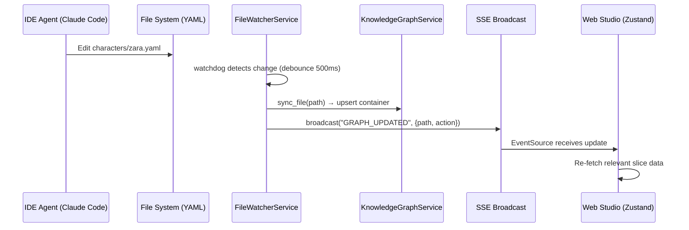
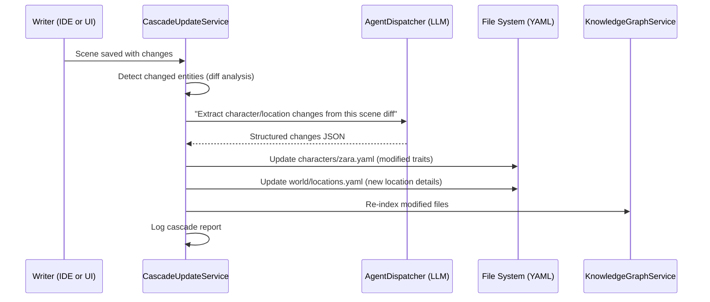

# Showrunner Phase L: IDE Integration, Git for Stories & Agent Skills
**Status:** Planned  
**Last Updated:** 2026-03-07  
**Depends On:** Phase J (Agentic Chat), Phase K (Unified Data Access Layer)

---

## 1. Phase Overview

Phase L bridges the gap between **Web Studio** and **IDE-based development** (Claude Code, Gemini, Cursor). It introduces proper story-level version control, cascade updates when story entities change, and a formalized agent skill/workflow system that IDE agents can discover and execute autonomously.

### Goals

1. **Story-level Git**: Version-control story YAML files with smart staging, AI commit messages, and arc-based branching
2. **IDE ↔ Web UI real-time sync**: File changes in the IDE reflect instantly in the Web Studio (and vice versa)
3. **Cascade Updates**: When a scene changes, automatically propagate updates to related characters, locations, and world state
4. **Formalized Agent Skills**: Standard `SKILL.md` frontmatter format + multi-step workflow files discoverable by any IDE agent
5. **Cloud Sync**: Optional Google Drive backup for story projects

---

## 2. Architecture Additions

### 2.1 New Services

| Service                         | File                                 | Purpose                                                                             |
| ------------------------------- | ------------------------------------ | ----------------------------------------------------------------------------------- |
| `CascadeUpdateService`          | `services/cascade_update_service.py` | Analyzes scene changes → extracts entity diffs via LLM → updates related YAML files |
| `CloudSyncService`              | `services/cloud_sync_service.py`     | Google Drive upload/download for project backups                                    |
| `FileWatcherService` (enhanced) | `services/file_watcher_service.py`   | Debounced YAML monitoring → KG sync → SSE broadcast                                 |

### 2.2 New Routers

| Router          | File                       | Key Endpoints                                                         |
| --------------- | -------------------------- | --------------------------------------------------------------------- |
| `git_router`    | `routers/git_router.py`    | `GET /log`, `GET /diff`, `POST /stage`, `POST /commit`, `GET /status` |
| `search_router` | `routers/search_router.py` | `GET /search?q=...&types=...` — full-text search across all entities  |
| `sync_router`   | `routers/sync_router.py`   | `POST /sync/push`, `POST /sync/pull` — cloud sync operations          |

### 2.3 New CLI Commands

| Command                         | File                  | Purpose                                       |
| ------------------------------- | --------------------- | --------------------------------------------- |
| `showrunner git stage-story`    | `commands/git_cmd.py` | Smart-stages only story YAML files            |
| `showrunner git commit-message` | `commands/git_cmd.py` | AI-generated commit message from staged diffs |
| `showrunner git history`        | `commands/git_cmd.py` | Git log filtered to story files               |
| `showrunner git diff`           | `commands/git_cmd.py` | Show changes to story files                   |
| `showrunner cascade update`     | `commands/cascade.py` | Trigger cascade update for a changed file     |

### 2.4 Data Flow: IDE Change → Web UI Update



### 2.5 Data Flow: Cascade Update



---

## 3. Git for Stories — Design Decision

### Problem

The `.gitignore` in the tool repository currently excludes all story data directories (`characters/`, `fragment/`, `world/`, `containers/`, etc.). This is correct for the **tool repo** but wrong for **story projects**.

### Solution

When `showrunner init "My Story"` creates a new project, generate a **project-level `.gitignore`** that:

```gitignore
# Showrunner Story Project — .gitignore
# Track all story YAML files (they ARE the content)

# System databases (rebuild on startup)
*.db
*.db-journal
*.db-wal

# Vector store (rebuilt from YAML)
.chroma/

# Python/Node artifacts
__pycache__/
node_modules/
.next/

# IDE/OS artifacts
.DS_Store
*.pyc

# Showrunner system files (rebuilt per session)
.showrunner/chat.db
.showrunner/sessions/*.tmp
```

The `showrunner git stage-story` command uses explicit path inclusion (`git add characters/ world/ containers/ fragment/ ...`) to bypass any `.gitignore` issues.

### Arc-Based Branching

Story branches map to Git branches:

| Story Concept           | Git Operation                      |
| ----------------------- | ---------------------------------- |
| New story arc           | `git checkout -b arc/redemption`   |
| Alternative ending      | `git checkout -b alt/villain-wins` |
| Versioned draft         | `git checkout -b draft/v2`         |
| Revert to earlier state | `git checkout <commit>`            |

---

## 4. Agent Skills — Formalization

### Current State

12 markdown files in `agents/skills/`, plain instructions without standard frontmatter or file I/O patterns.

### Target State

Each skill follows the standard `SKILL.md` format:

```yaml
---
name: scene_writer
description: Write a complete scene from outline + context, outputting structured YAML
version: "1.0"
triggers:
  - "write scene"
  - "draft scene"
  - "write fragment"
output_format: yaml
output_path: "fragment/{scene_slug}.yaml"
required_context:
  - characters
  - world
  - story_structure
  - previous_scenes
---

# Scene Writer Agent

## Role
You are an expert fiction writer specializing in immersive scene creation...

## Workflow
1. Load the scene's outline from `containers/`
2. Gather character sheets from `characters/`
3. Read the world bible from `world/settings.yaml`
4. Load previous scenes for continuity
5. Write prose in the project's narrative style
6. Save to `fragment/{scene_slug}.yaml`
7. Run cascade update: `showrunner cascade update fragment/{scene_slug}.yaml`
8. Commit: `showrunner git stage-story && showrunner git commit-message`

## Output Schema
...
```

### New Skills to Create

| Skill File               | Purpose                                                         |
| ------------------------ | --------------------------------------------------------------- |
| `writing_agent.md`       | **Missing** — Draft prose from outlines (most-referenced skill) |
| `session_manager.md`     | Start/end writing sessions with auto-briefing                   |
| `character_updater.md`   | Update character YAML after scene events                        |
| `git_story_ops.md`       | Version control workflow for story files                        |
| `project_initializer.md` | Bootstrap new story projects end-to-end                         |
| `continuity_reviewer.md` | Full project continuity audit                                   |

### Workflow Files (`.agents/workflows/`)

Multi-step automated flows:

| Workflow           | Steps                                                     |
| ------------------ | --------------------------------------------------------- |
| `write-scene.md`   | Load context → brainstorm → write → cascade → commit      |
| `new-chapter.md`   | Create structure → outline scenes → write first scene     |
| `daily-session.md` | Brief → write → cascade → commit → end session            |
| `arc-planning.md`  | Story architect → populate structure → outline all scenes |

---

## 5. Frontend Requirements

### 5.1 Wire Stubbed Store Slices

The `ChatSlice` in `store.ts` has no-op functions that must be connected:

| Stub Function         | Connect To                |
| --------------------- | ------------------------- |
| `fetchChatSessions()` | `api.getChatSessions()`   |
| `loadMessages()`      | `api.getChatMessages()`   |
| `deleteSession()`     | `api.deleteChatSession()` |
| `createSession()`     | `api.createChatSession()` |

### 5.2 SSE-Driven Store Refresh

When `useProjectEvents.ts` receives `GRAPH_UPDATED`, auto-refresh:
- Character list
- Scene list
- World data
- Knowledge graph

### 5.3 Git Panel (New Component)

A simple panel in the Command Center showing:
- Current branch
- Uncommitted story changes
- Recent commit history
- Stage + commit button

### 5.4 Cascade Update Trigger (Zen Mode)

After saving a scene in Zen Mode, show a toast: "Run cascade update?" → triggers `POST /api/v1/cascade/update`.

---

## 6. Engineering Quality

### 6.1 Commit Hygiene

All 17 uncommitted files (9 untracked + 8 modified) must be staged and committed before Phase L work begins.

### 6.2 Router Registration

Ensure all routers are:
1. Imported in `routers/__init__.py`
2. Registered in `app.py` with `include_router()`
3. Have matching API client functions in `src/web/src/lib/api.ts`

### 6.3 Testing

| Test Area            | Type               | Files                                   |
| -------------------- | ------------------ | --------------------------------------- |
| CascadeUpdateService | Unit + Integration | `tests/services/test_cascade_update.py` |
| GitRouter            | Integration        | `tests/routers/test_git_router.py`      |
| FileWatcherService   | Integration        | `tests/services/test_file_watcher.py`   |
| ChatSlice wiring     | Frontend unit      | `tests/web/store.test.ts`               |
