# Schema Builder: UX & Architecture Recommendation

**Phase 4 of Showrunner's Roadmap** — Enabling users to dynamically define custom Container types without writing YAML.

---

## 1. UX Design Philosophy

### 1.1 Three Interaction Modes

The Schema Builder must serve three distinct user archetypes with a single unified panel:

| Mode | Persona | Entry Point |
|---|---|---|
| **Wizard (NL)** | "Just tell me what you want" | Chat input → Schema Wizard Agent auto-generates fields |
| **Visual Builder** | Notion/Strapi power user | Click-to-add field rows in a structured form |
| **Raw YAML** | Developer / precision user | Monaco editor with live Pydantic validation |

All three modes produce the same output: a `ContainerSchema` JSON object that the backend's `SchemaRepository` persists as a YAML file in `/schemas/`.

### 1.2 UX Inspiration: Notion + Strapi Hybrid

**From Notion — The "Property Row" Pattern:**
- Each field is a horizontal row: `[Icon] [Field Name] [Type Dropdown] [⋯ Menu]`
- Clicking a type badge opens a popover with the type picker (String, Integer, Boolean, List, Reference, etc.)
- Drag handles on the left enable reorder via `@dnd-kit/sortable`
- Inline editing — no separate "edit field" modal. Everything is visible and editable in place.

**From Strapi — The "Content Type Builder" Flow:**
- A dedicated full-width panel (not a tiny popover) for the builder, accessed from a sidebar "Schemas" tab
- Clear separation: **left column** = list of existing schemas, **right column** = active schema editor
- "Add another field" button at the bottom with a type-selection grid (cards with icons + labels for each `FieldType`)
- Built-in validation indicators: red borders on missing required fields, character limits on `name`

### 1.3 Recommended Layout

```
┌─────────────────────────────────────────────────────────────────┐
│  SCHEMA BUILDER                                    [Save] [×]  │
├──────────────┬──────────────────────────────────────────────────┤
│              │  ┌────────────────────────────────────────────┐  │
│  Schemas     │  │  Display Name: [ Magical Artifact       ]  │  │
│  ─────────── │  │  Type Key:     magical_artifact (auto)     │  │
│  ▶ Character │  │  Description:  [ A magical item tracked…]  │  │
│  ▶ Scene     │  │                                            │  │
│  ▶ Location  │  │  ── Fields ────────────────────────────── │  │
│  ▶ Faction   │  │  ≡  name        [String ▾]   ★ required   │  │
│              │  │  ≡  power_level [Integer ▾]   ○ optional   │  │
│  + New       │  │  ≡  origin      [Ref:Faction] ○ optional  │  │
│              │  │                                            │  │
│              │  │  [ + Add Field ]                           │  │
│              │  │                                            │  │
│  ─────────── │  │  ── OR: Describe in Natural Language ──── │  │
│  AI Wizard   │  │  ┌──────────────────────────────────────┐  │  │
│  💬 "Create  │  │  │ "A spaceship that tracks fuel,      │  │  │
│   a spell…"  │  │  │  hull integrity, and captain"       │  │  │
│              │  │  └──────────────────────────────────────┘  │  │
│              │  │  [✨ Generate Fields]                      │  │
│              │  └────────────────────────────────────────────┘  │
└──────────────┴──────────────────────────────────────────────────┘
```

---

## 2. Frontend ↔ Backend Contract

### 2.1 API Endpoints (FastAPI)

```
GET    /api/v1/schemas/                → List[ContainerSchema]
GET    /api/v1/schemas/{name}          → ContainerSchema
POST   /api/v1/schemas/               → ContainerSchema  (create)
PUT    /api/v1/schemas/{name}          → ContainerSchema  (update)
DELETE /api/v1/schemas/{name}          → { "deleted": true }
POST   /api/v1/schemas/generate        → ContainerSchema  (NL → AI)
POST   /api/v1/schemas/{name}/validate → { "valid": bool, "errors": [...] }
```

### 2.2 TypeScript Types (Frontend)

```typescript
// Maps 1:1 to the backend FieldType enum
type FieldType =
  | "string"
  | "integer"
  | "float"
  | "boolean"
  | "list[string]"
  | "json"
  | "enum"       // extension: requires `options`
  | "reference"; // extension: requires `target_type`

interface FieldDefinition {
  name: string;
  field_type: FieldType;
  description?: string;
  default?: unknown;
  required: boolean;
  // extensions for specific types
  options?: string[];      // for "enum"
  target_type?: string;    // for "reference"
}

interface ContainerSchema {
  name: string;            // lower_snake_case key
  display_name: string;
  description?: string;
  fields: FieldDefinition[];
}
```

### 2.3 Mapping Frontend Fields → Backend `FieldType`

| UI Label | `FieldType` Enum | Pydantic Python Type | UI Widget |
|---|---|---|---|
| Text | `string` | `str` | `<input type="text">` |
| Number | `integer` | `int` | `<input type="number">` |
| Decimal | `float` | `float` | `<input type="number" step="0.01">` |
| Toggle | `boolean` | `bool` | `<Switch>` |
| Tags | `list[string]` | `List[str]` | Tag input (pills) |
| Rich Data | `json` | `Dict[str, Any]` | Monaco/JSON editor |
| Dropdown | `enum` | `Literal[...]` | `<Select>` with options |
| Link | `reference` | `UUID` | Entity picker autocomplete |

---

## 3. Component Architecture

### 3.1 New Components Required

```
src/web/src/
├── app/schemas/
│   └── page.tsx                    ← Route: /schemas (Schema Builder page)
├── components/schema-builder/
│   ├── SchemaBuilderPanel.tsx      ← Main panel (list + editor layout)
│   ├── SchemaList.tsx              ← Left sidebar: list of existing schemas
│   ├── SchemaEditor.tsx            ← Right panel: edit fields of selected schema
│   ├── FieldRow.tsx                ← Single field row (draggable, inline-editable)
│   ├── FieldTypeSelector.tsx       ← Popover/grid for picking FieldType
│   ├── NLWizardInput.tsx           ← Natural language input + "Generate" button
│   └── SchemaPreview.tsx           ← Live YAML/JSON preview of the schema
├── lib/
│   └── api.ts                      ← Extended with schema CRUD methods
```

### 3.2 State Management

The Schema Builder does **not** need its own Zustand slice initially. It operates as an independent page with local React state (`useState` / `useReducer`). Reasons:

1. Schema editing is a **discrete modal workflow**, not a persistent canvas state.
2. The output (a saved `ContainerSchema`) flows into the main graph via a simple refetch.
3. Avoids bloating the performance-critical `reactFlowSlice` with rarely-changing schema data.

### 3.3 Field Row Interaction (Key UX Detail)

Each `FieldRow` renders as:

```
[≡ drag] [name input] [type badge ▾] [required ★/○ toggle] [description input] [🗑]
```

- **Type Badge**: Clicking opens `FieldTypeSelector` popover. Choosing "Reference" reveals a secondary dropdown for `target_type` (populated from existing schema names). Choosing "Enum" reveals a tag-input for `options`.
- **Drag Reorder**: Uses `@dnd-kit/sortable` (already a project dependency from `ContainerCard.tsx`).
- **Delete**: Soft-delete with undo toast for 5 seconds.

---

## 4. Backend Extensions Required

### 4.1 Extended `FieldType` Enum

The existing `FieldType` enum in [container.py](file:///Users/vikasahlawat/Documents/writing_tool/src/antigravity_tool/schemas/container.py) supports 6 types. The `schema_architect.md` skill already describes `enum` and `reference` types. Align the backend:

```python
class FieldType(str, Enum):
    STRING = "string"
    INTEGER = "integer"
    FLOAT = "float"
    BOOLEAN = "boolean"
    LIST_STRING = "list[string]"
    JSON = "json"
    ENUM = "enum"           # NEW — maps to Literal[...] with options
    REFERENCE = "reference" # NEW — maps to UUID with target_type constraint
```

### 4.2 Extended `FieldDefinition`

```python
class FieldDefinition(AntigravityBase):
    name: str
    field_type: FieldType = FieldType.STRING
    description: Optional[str] = None
    default: Any = None
    required: bool = False
    options: Optional[List[str]] = None      # for ENUM
    target_type: Optional[str] = None        # for REFERENCE
```

### 4.3 Schema CRUD Router

A new `schemas_router.py` in `/server/routers/`:

```python
@router.get("/schemas/")
@router.get("/schemas/{name}")
@router.post("/schemas/")
@router.put("/schemas/{name}")
@router.delete("/schemas/{name}")
@router.post("/schemas/generate")   # NL → Schema Wizard Agent
@router.post("/schemas/{name}/validate")
```

### 4.4 Validation Endpoint

The `/validate` endpoint instantiates the dynamic Pydantic model via `ContainerSchema.to_pydantic_model()` and tries to parse a sample payload, returning any `ValidationError` details as structured JSON for the frontend to display inline.

---

## 5. Schema Wizard Agent Integration

When the user types a natural language description and clicks "Generate Fields":

```mermaid
sequenceDiagram
    participant U as User (Browser)
    participant F as Next.js Frontend
    participant B as FastAPI Backend
    participant LLM as Schema Wizard Agent (LLM)

    U->>F: "A spaceship tracking fuel and captain"
    F->>B: POST /api/v1/schemas/generate { "prompt": "..." }
    B->>LLM: System Prompt (schema_wizard.md) + User Prompt
    LLM-->>B: JSON Array of FieldDefinition objects
    B->>B: Validate against FieldType enum
    B-->>F: ContainerSchema (draft, unsaved)
    F->>U: Populate FieldRows — user can edit before saving
```



The generated schema is always a **draft**. The user reviews, tweaks, and explicitly saves. This preserves the "Glass Box" transparency principle from the DESIGN.md.

---

## 6. Implementation Priority

| Priority | Item | Complexity |
|---|---|---|
| P0 | Backend: Schema CRUD router + extended `FieldType` enum | Low |
| P0 | Frontend: `SchemaBuilderPanel` + `FieldRow` components | Medium |
| P1 | NL Wizard: `/schemas/generate` endpoint + `schema_wizard.md` skill | Medium |
| P1 | Live YAML preview panel | Low |
| P2 | Drag-reorder fields with `@dnd-kit/sortable` | Low |
| P2 | Reference type: entity-picker autocomplete connected to graph | Medium |
| P3 | Schema versioning (track changes to schema definitions over time) | High |

---

## 7. Open Questions for User

1. **Schema Deletion Safety**: Should deleting a schema also delete all container instances of that type, or just orphan them? Recommendation: orphan with a warning banner.
2. **Schema Locking**: Once containers of a type exist, should schema edits be restricted (Strapi-style "draft/published") or freely editable with migration warnings?
3. **Enum Extensibility**: Should enum options be extensible per-instance (like Notion's Select), or strictly enforced (like a DB constraint)?
